# (PART) Chapter 1 Price and Risk {.unnumbered}

# Returns 

Let $P_t$ denote the price of a stock at time $t$. The return is the relative change in the price of a financial asset over a given time interval, often represented as a percentage.

## Simple return

A simple return is the percentage change in prices indicated by R
$$ R_t=\frac{P_t-P_{t-1}}{P_{t-1}}=\frac{\Delta P_t}{P_{t-1}} $$

A n-period return is given by
$$\begin{align*} R_t(n)&=\frac{P_t}{P_{t-n}}-1\\
&=\frac{P_t}{P_{t-1}} \times \frac{P_{t-1}}{P_{t-2}} \times ... \times \frac{P_{t-n+1}}{P_{t-n+2}}-1\\
&=(1+R_t)(1+R_{t-1})(1+R_{t-2})...(1+R_{t-n+1})-1 
\end{align*}$$

## Logarithm return

The logarithm of gross return is called continuously compounded return

$$ Y_t(1)=\log(1+R_t)=\log \left( \frac{P_t}{P_{t-1}} \right)=\log(P_t)-\log(P_{t-1}) $$

An $n-period$ return is given by
$$\begin{align*} 
Y_t(n)&=\log(1+R_t(n)) \\
&=\log((1+R_t)(1+R_{t-1})(1+R_{t-2})...(1+R_{t-n+1})) \\
&=\log(1+R_t)+\log(1+R_{t-1})+\log(1+R_{t-2})...+\log(1+R_{t-n+1})) \\
&=Y_t+Y_{t-1}+Y_{t-2}+...+Y_{t-n+1} 
\end{align*}$$

## Remark

### Approximation

For small price changes the difference of simple return and log return is small (negligible). Indeed, from Taylor approximation we have
$$ \log(1+x)=x-\frac{x^2}{2}+\frac{x^3}{3}+... \approx x $$

Simple or log-return is approximately equal with returns under 10% since there is not large difference between $R_t$ and $Y_t$ as the time between observations goes to zero $\lim_{\Delta t \to 0} Y_t = R_t$.
  
$$\log(1000) − \log(995) = 0.005012 \approx \frac{1000}{995} − 1 = 0.005025 \\
\log(1000) − \log(885) = 0.12216 \neq \frac{1000}{885} − 1 = 0.12994$$

### Symmetry property

Continuous compounded return is symmetry, but Simple return is not. For example

$$\begin{align*}
\log \left( \frac{1000}{500} \right) &=-\log \left( \frac{500}{1000} \right) \\
\frac{1000}{500}-1 &\neq - \left( \frac{500}{1000}-1 \right)
\end{align*}$$

### Portfolio Return

Consider a portfolio of $N$ stocks with simple returns $R_t$,$i$ at time $t$, respectively. Denote $R_{t,p}$ the return of portfolio at time $t$, $Y_t$,$p$ the continuously compounded return of the portfolio at time $t$.

1. We have the simple return of the portfolio is (proof!!!) 

$$ R_{i,p}=\sum_{i=1}^{N} \omega_i R_{t,i} $$

2. For continuously compounded returns we do not have equality

$$ 
Y_{t,p}= \log \left( \frac{P_{t,p}}{P_{t-1,p}} \right) \neq \sum_{i=1}^{n} \omega_i \left( \frac{P_{t,i}}{P_{t-1,i}} \right) =\sum_{i=1}^{n} \omega_i Y_{t,i} 
$$

However, the difference between compounded and simple returns may not be very significant for small returns, e.g., daily return
$$Y_p=\sum_{i=1}^N \omega_i R_i $$
when time between observations goes to 0, then we have
$$\lim_{\Delta t \to 0} Y_{t,p} = R_{t,p}$$

So, in practice we note that

* Simple returns are
<ul>
<li>Used for accounting purposes.</li>
<li>Investors are usually concerned with simple returns.</li>
</ul>
* Continuously compounded returns have some advantages
<ul>
<li>Mathematics is easier, we will see later.</li>
<li>Used in derivatives pricing, e.g. the Black–Scholes model.</li>
</ul>

# Random Walk

Let sequence $X_1, X_2, ...,X_t$ be i.i.d random variables and $S_0$ be an arbitrary starting point and
$$S_t=S_0+X_1+X_2+...+X_t $$
The series $(S_t)_{t \geq 0}$ is a called random walk and $X_1, X_2, ...,X_t$ are its steps.

## Simple random walk

Let series $(S_t)_{t \geq 0}$ be a random walk
$$S_t=S_0+X_1+X_2+...+X_t $$
If the steps are either $1$ or $-1$ with a $50\%$ probability for either value, and set $S_{0}=0$ then the random walk is called a simple random walk.


```r
library(tidyverse)
simple=map(1:9,
              ~sample(c(1,-1), 
                 size=250, 
                 replace=T,
                 prob=c(0.5,0.5)) %>% 
              cumsum())
```


```r
par(mfrow=c(3,3))
plots=simple %>% 
  map(
      plot,         
      type="l", 
      col="blue",
      ylab="the accumulated money")
```

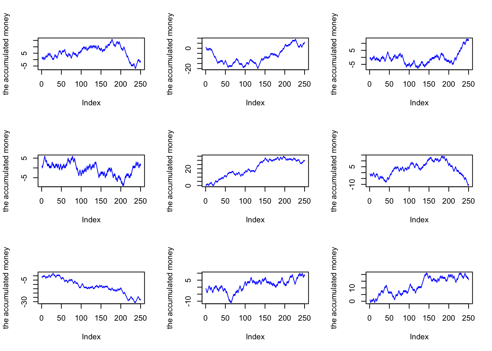


```r
par(mfrow=c(3,3))
plots=simple %>%
  map(acf)
```


## Normal random walk

Let series $(S_t)_{t \geq 0}$ be a random walk
$$S_t=S_0+Z_1+Z_2+...+Z_t $$
If the steps follow standard normal distribution, i.e. $Z \sim \mathcal{N}(0,1)$, then the random walk is called a normal random walk. We have $E[S_t|S_0]=S_0$ and $\mathbb{Var}(S_t|S_0)=\sigma_t^2=\sigma^2 t$.


```r
library(tidyverse)
normal=map(1:9,
              ~rnorm(250,0,1) %>% 
              cumsum()) 
```


```r
par(mfrow=c(3,3))
plots=normal %>% 
  map(
      plot,         
      type="l", 
      col="blue",
      ylab="the accumulated money")
```


```r
par(mfrow=c(3,3))
plots=normal %>% 
  map(acf)
```

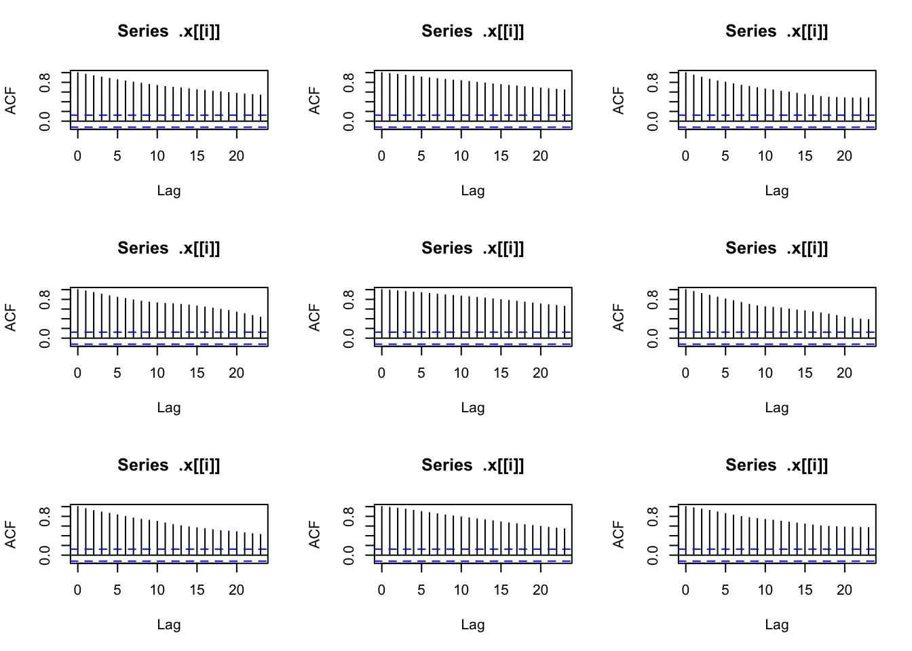

## Random walk with drift

Let series $(S_t)_{t \geq 0}$ be a random walk
$$\begin{align*}
S_t&=S_0+X_1+X_2+...+X_t \\
&=S_{t-1}+X_t \\
&= \mu + S_{t-1}+ Z_t 
\end{align*}$$
If the steps are normally distributed, i.e. $X \sim \mathcal{N}(\mu,\sigma)$, then the random walk is called a random walk with drift. We have $E[S_t|S_0]=S_0+ \mu t$ and $\mathbb{Var}(S_t|S_0)=\sigma_t^2=\sigma^2 t$.


```r
library(tidyverse)
drift=map(1:9,
              ~rnorm(250,1,5) %>% 
              cumsum()) 

par(mfrow=c(3,3))
plots=drift %>% 
  map(
      plot,         
      type="l", 
      col="blue",
      ylab="the accumulated money")
```


```r
par(mfrow=c(3,3))
plots=drift %>% 
  map(acf)
```


## Geometric random walk

Let series $(Y_t(t))_{t \geq 0}$ be a random walk
$$\begin{align*}
Y_t(t)&=Y_1+Y_2+...+Y_t \\
\log \left( \frac{P_t}{P_0}\right)&=Y_1+Y_2+...+Y_t \\
P_t&=P_0e^{Y_1+Y_2+...+Y_t}
\end{align*}$$
$(P_t)_{t \geq0}$ is called geometric random walks or exponential random walk. If $Y_1,Y_2,...,Y_t$ are i.i.d and $Y \sim \mathcal{N}(\mu,\sigma^2)$, then $P_t$ is a lognormal random walk. 


```r
library(tidyverse)
geometric=map(1:9,
          ~ exp(log(120)+
                cumsum(rnorm(250,
                        0/250,
                        1/sqrt(250))))) 

par(mfrow=c(3,3))
plots=geometric %>% 
  map(
      plot, 
      type="l", 
      col="blue",
      ylab="the accumulated money")
```

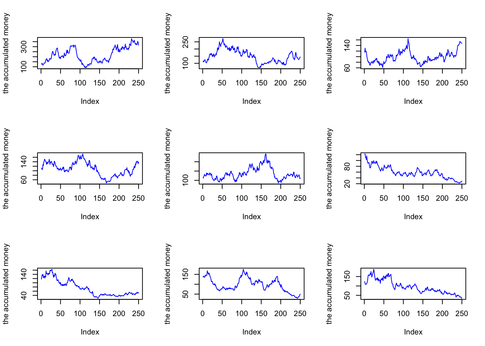


```r
par(mfrow=c(3,3))
plots=geometric %>% 
  map(acf)
```

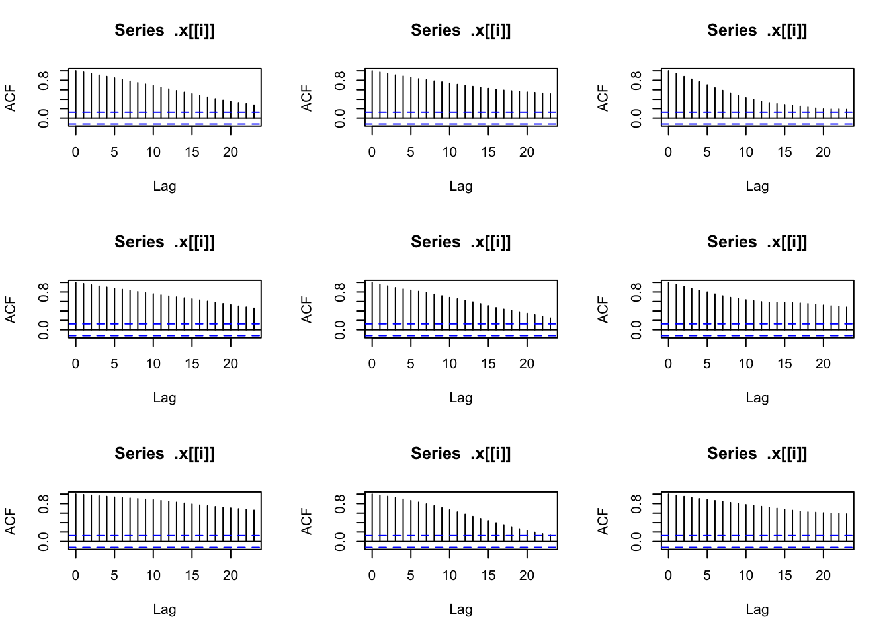
 
**Remark**

The lognormal geometric random walk needs two assumptions: The log returns are normally distributed and the log returns are mutually independent. In general, prices does not usually follow a lognormal geometric random walk or its continuous-time analog, geometric Brownian. The independence assumption can be also violated since returns exhibit volatility clustering, i.e., if we see high volatility in current returns then we can expect this higher volatility to continue, at least for a while motion.

# Volatility 

* Unconditional volatility, or volatility for short, is volatility over an
entire time period, denoted by $\sigma$.
* Conditional volatility is volatility in a given time period, conditional
on what happened before, denoted by $\sigma_t$.
* The subscript t means that it is volatility on a particular time period, usually a day.
* Clear evidence of cyclical patterns in volatility over time, both in the short run and the long run.

<center>

</center>

## Calculations

Consider a sample $x_i$ with mean $\mu$ and sample size $N$. Then we have an estimation of volatility:

For daily volatility
$$\sigma=\sqrt{\frac{1}{N}\sum_{n=1}^{\infty} (x_i-\mu)^2}$$

For annualy volatility
$$\sigma=\sqrt{250}\sqrt{\frac{1}{N}\sum_{n=1}^{\infty} (x_i-\mu)^2}$$

## Volatility cluster

The volatility over a decade, year and month, we see that it comes in many cycles we called these volatility clusters. The following figure describes the daily volatility of McDonald’s stock from 2010-2014.


```r
library(tidyquant)
mcd <- tq_get('MCD', 
               from=as.Date("2010-01-01"),
               to=as.Date("2014-01-01"),
               get = "stock.prices")

mcd_logret=mcd$adjusted %>% 
  log() %>% 
  diff()

plot(mcd$date[-1],mcd_logret,type="l",col="blue")
```


# Skewness & Kurtosis

Note that under the Random Walk model, assuming independent Gaussian single-period returns, the distribution of both multi-period returns and the prices are derived. However, log returns are typically heavy tailed and thus these results are in question.

Skewness, kurtosis are important descriptive statistics of data distribution that answer that question. While skewness essentially measures the symmetry of the distribution, kurtosis determines the heaviness of the distribution tails.

## Skewness

<center>

</center>

### Definition {.unnumbered}

The skewness of a random variable X is
$$S_k= \mathbb{E}  \left\{ \frac{X-\mathbb{E}[X]}{\sigma} \right\}^3=\frac{\mathbb{E}[(X-\mathbb{E}[X])^3]}{\sigma^3} $$
Skewness measures the degree of asymmetry.

### Types of skewness {.unnumbered}

<center>

</center>

### Symmetric distribution

$S_k=0$ indicated a symmetric distribution, i.e., normal distribution or t distribution.

<h4>Normal distribution</h4>

```r
library(moments)
n=rnorm(n=1000, mean = 0, sd = 1)
hist(n)
print(c(skewness(n),mean(n),median(n)))
#> [1] -0.071698111 -0.001422871 -0.023070733
```

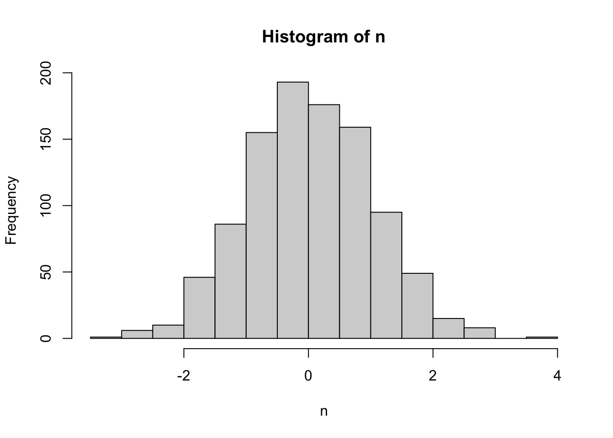
Since $skewness=-0.07$ approximately equal $0$, the distribution is not skew and $mean=0$ approximately equal $median=-0.02$.

<h4>t distribution</h4>

```r
library(moments)
t=rt(n=1000,df=10)
hist(t)
print(c(skewness(t),mean(t),median(t)))
#> [1] -0.06792492  0.01644737 -0.01850613
```


Since $skewness=-0.07$ approximately equal $0$, the distribution is not skew and $mean=0.02$ approximately equal $median=-0.02$.

### Right-skewed

$S_k>0$ indicates a relatively long right tail compared to the left tail, i.e., distribution has a heavy tail on the right hand side.

```r
library(moments)
library(fGarch)
sr=rsnorm(n=1000, mean = 0, sd = 1, xi = 5)
hist(sr)
print(c(skewness(sr),mean(sr),median(sr)))
#> [1]  0.97928426  0.03187995 -0.19129275
```

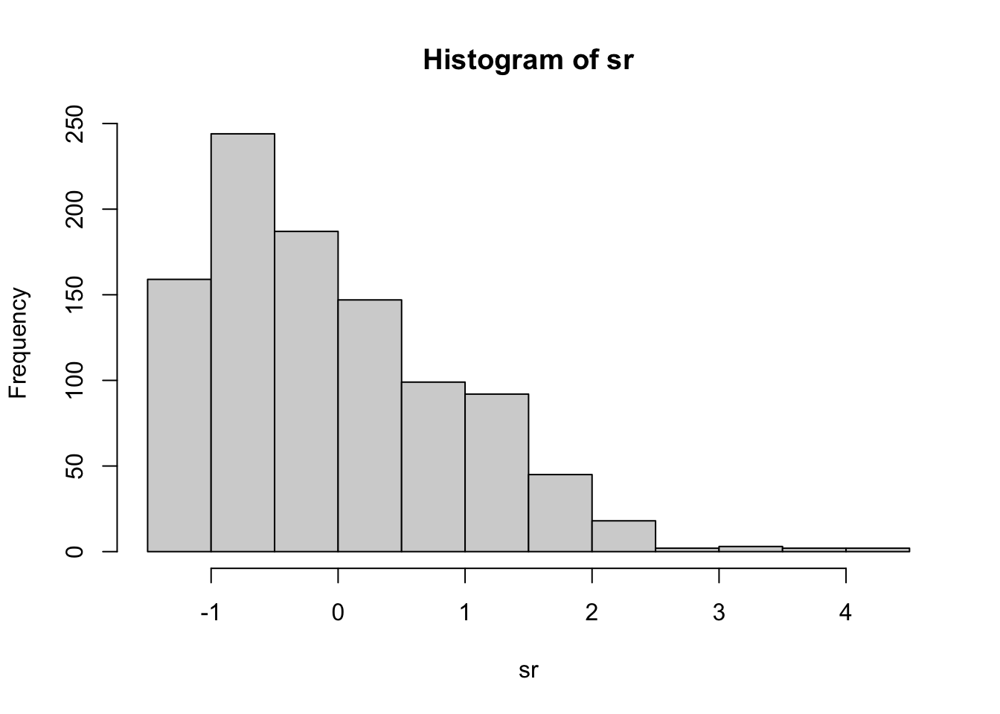
Since $skewness=0.98$ is greater than $0$, the distribution is right-skew and $mean=0.03$ is greater than $median=-0.19$.

### Left-skewed

$S_k<0$ (left-skewed) indicates a relatively long left tail compared to the right tail, i.e., distribution has a heavy tail on the left hand side.

```r
library(moments)
library(fGarch)
sl=rsnorm(n=1000, mean = 0, sd = 1, xi = -2)
hist(sl)
print(c(skewness(sl),mean(sl),median(sl)))
#> [1] -0.78925516 -0.02864372  0.10016168
```

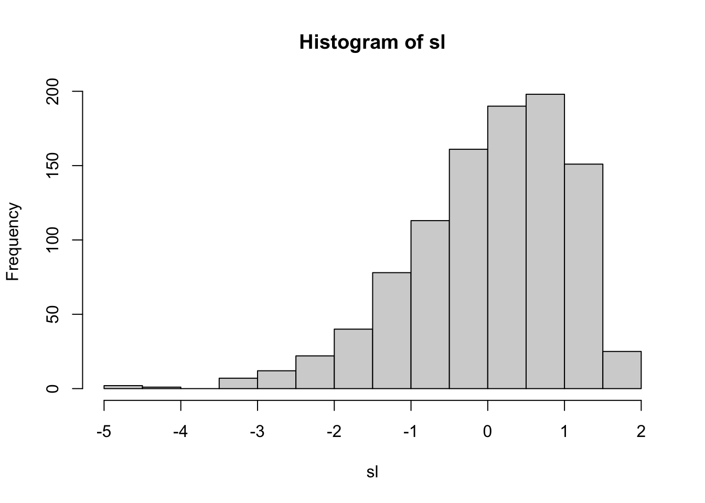
Since $skewness=-0.79$ is less than $0$, the distribution is left-skew and $mean=-0.03$ is less than $median=0.1$.


## Kurtosis

### Definition {.unnumbered}

The Kurtosis of a random variable X is
$$S_k= \mathbb{E}  \left\{ \frac{X-\mathbb{E}[X]}{\sigma} \right\}^4=\frac{\mathbb{E}[(X-\mathbb{E}[X])^4]}{\sigma^4} $$
Kurtosis is a statistical measure that defines how heavily the tails of a distribution differ from the tails of a normal distribution. In other words, kurtosis identifies whether the tails of a given distribution contain extreme values.

In finance, kurtosis is used as a measure of financial risk. A large kurtosis is associated with a high level of risk for an investment because it indicates that there are high probabilities of extremely large and extremely small returns. On the other hand, a small kurtosis signals a moderate level of risk because the probabilities of extreme returns are relatively low.

### Example {.unnumbered}

Let X follow a normal distribution $N(0, 1)$. Then $$Kur(X)=3$$

Let X follow a binomial distribution $B(p, n)$. Then $$Kur(X)=3+\frac{1-6p(1-p)}{np(1-p)}$$

Let X follow a t distribution $t(df=\nu)$. Then $$Kur(X)=3+\frac{6}{\nu-4}$$

### Types of Kurtosis {.unnumbered}

Let the excess kurtosis $\kappa(X)=Kur(X)-3$, we have the following definitions:

<center>

</center>

### Mesokurtic

A mesokurtic distribution shows an excess kurtosis of zero or close to zero. Normal distribution is a typical example of mesokurtic.</li>

```r
library(moments)
n=rnorm(n=10000, mean = 0, sd = 1)
hist(n)
kurtosis(n)
#> [1] -0.02280057
#> attr(,"method")
#> [1] "excess"
```


### Leptokurtic

A Leptokurtic distribution shows a positive excess kurtosis $(\kappa > 0)$. The leptokurtic distribution shows heavy tails on either side, indicating large outliers. t distribution with a low degree of freedom is a typical example of mesokurtic.

In finance, a leptokurtic distribution shows that the investment returns may be prone to extreme values on either side. Therefore, an investment whose returns follow a leptokurtic distribution is considered to be risky. It means that big losses (as well as big gains) can occur.


```r
library(moments)
t=rt(n=1000,df=2)
hist(t)
kurtosis(t)
#> [1] 48.58015
#> attr(,"method")
#> [1] "excess"
```

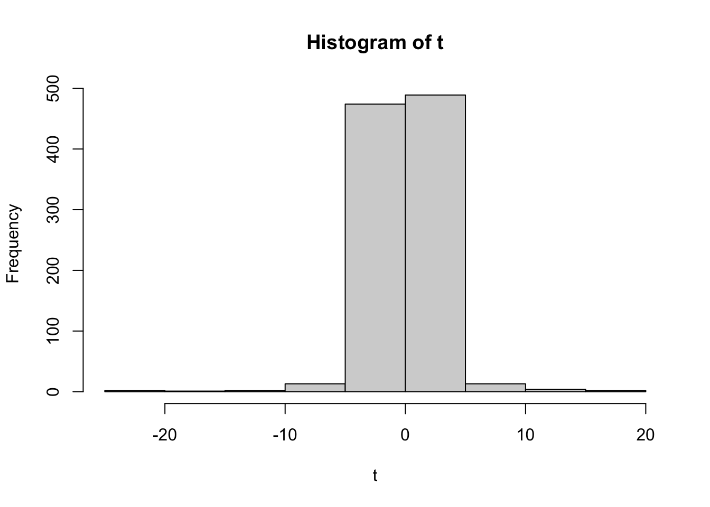

### Platykurtic

A platykurtic distribution shows a negative excess kurtosis $(\kappa < 0)$. The kurtosis reveals a distribution with flat tails. The flat tails indicate the small outliers in a distribution. 

In the finance context, the platykurtic distribution of the investment returns is desirable for investors because there is a small probability that the investment would experience extreme returns.


```r
library(moments)
library(e1071)                    
duration = faithful$eruptions     
hist(duration)
kurtosis(duration)
#> [1] -1.511605
```


## Financial situation 

If two investments’ return distributions have identical mean and variance, but different skewness parameters. Which one is to prefer? 

Typically, risk managers are wary of negative skew, in this situation, small gains are the norm, but big losses can occur, carrying risk of going bankruptcy.  

If a return distribution shows a positive skew, investors can expect recurrent small losses and few large returns from investment. Conversely, a negatively skewed distribution implies many small wins and a few large losses on the investment.  

Hence, a positively skewed investment return distribution should be preferred over a negatively skewed return distribution since the huge gains may cover the frequent – but small – losses. However, investors may prefer investments with a negatively skewed return distribution. It may be because they prefer frequent small wins and a few huge losses over frequent small losses and a few large gains.

## Moments

In basic statistic and probability theory, we almost exclusively deal with the first and second center moment of a random variable, namely expectation and variance $\mathbb{E}[X]$ and $\mathbb{E}[(X-\mu)^2]$. The concept can be generalized to

* k−th moment of X: $m_k :=\mathbb{E}(X_k)$
* k−th center moment of X:$\mu_k :=\mathbb{E}[(X−\mu)^k]$

Using the notation, the population skewness and kurtosis can be rewritten as:
$$\begin{align*} 
Sk(X)&=\frac{\mu_3}{\mu_2^{3/2}}  \\ 
Kur(X)&=\frac{\mu_4}{\mu_2^{2}}
\end{align*}$$

Let $X_1, X_2, ..., X_n$ be observations of X with sample mean $\bar{X}$ and sample standard deviation $s$. 
Then the sample skewness denoted by $\widehat {Sk}$ is
$$ \widehat {Sk}=\frac{1}{n} \sum_{i=1}^{n} \left( \frac{X_i-\bar{X}}{s} \right)^3 $$
and the sample kurtosis denoted by $\widehat {Kur}$ is
$$ \widehat {Kur}=\frac{1}{n} \sum_{i=1}^{n} \left( \frac{X_i-\bar{X}}{s} \right)^4 $$

# Fat tails 

## Definition

The tails are the extreme left and right parts of a distribution. A random variable is said to have fat tails (also known as heavy tails) if it exposes more extreme outcomes than a normal distributed random variable with the same mean and variance. In other words, fat tails describe the greater-than-expected probabilities of extreme values. 

Financial advisors have used the mean–variance method to model the distribution of probabilities for the values of a quantity, such as price returns. The mean–variance model assumes normality so fat tails should not present in the data.

## Example {.unnumbered}

The t-Student distribution is convenient for modeling a fat tailed distribution. Consider the t-distribution X with degrees of freedom $\nu$. The values of $\nu$ indicate how fat the tails are

* If $\nu=\infty$ then X is the normal random variable.
* If $\nu<2$ then X follows a fat tail distribution.
* For a typical stock we have $3<\nu<5$.

## Identification of fat tails

Two main approaches for identifying and analyzing tails of financial returns including statistical methods: The Jarque-Bera Test and graphical methods: QQ plots.

### Statistical methods

The Jarque-Bera (JB) tests are popular statistical methods to test for fat tails
$$ JB=n \left(\frac{\widehat{Sk}}{6}+\frac{(\widehat{Kur}-3)^2}{24} \right) \sim \chi^2 $$
Under the hypothesis of normality, data should be symmetrical, i.e. skewness should be equal to zero and have skewness chose to three.

### Graphical methods

In general, a Q-Q plot compares the quantiles of the data with the quantiles of a reference distribution; if the data are from a distribution of the same type, a reasonably straight line should be observed.

* A QQ plot (quantile-quantile plot) compares the quantiles of sample data against quantiles of a reference distribution, like normal.
* Used to assess whether a set of observations has a particular distribution.
* Can also be used to determine whether two datasets have the same distribution.

#### Quantile

The pth quantile of CDF F of a random variable X is that the value $x_p$ such that

$$F(x_p) = p \quad \text{or} \quad x_p = F^{−1}(p)$$

#### Q-Q plot

The theoretical Q-Q plot is the graph of the quantiles of the CDF $F(x_p)=p$ or $x_p = F^{−1}(p)$, versus the corresponding quantiles of the CDF, $G(y_p)=p$ or $y_p = G^{−1}(p)$ that is the graph $(F^{−1}(p), G^{−1}(p))$ for $p \in (0, 1)$.
 
If $G(x) = F \left(\frac{x−\mu}{\sigma} \right)$ for some constants $\mu$ and $\sigma \neq 0$ then
$$y_p = \mu + \sigma x_p$$

##### Example {.unnumbered}

Let $F \sim \mathcal{N}(0,1)$ then $G(x) = F\left(\frac{x−1}{\sqrt{2}} \right) ∼ N(1,2)$. Now if we choose $x_p = −3$ which corresponds to $p = 0.001349898$. With this probability we obtain the quantile of distribution $G$ is $y_p = −3.242641$. Now from the property of Q-Q plots we have
$$y_p=1+\sqrt{2} \times (-3)=-3.242641$$

Generate a standard normal distribution from $-10$ to $10$. We compare with $N(0, 1)$, we get
  
<center>

</center>

#### Empirical Q-Q plots

Denote $F$ the specified CDF (e.g., normal) model. $G$ is the empirical CDF for observations $x_1, x_2, .., x_n$ of random sample $X_1, X_2, ..., X_n$. To compare the observation $G$ and model $F$

* Plot $F^{−1} \left( \frac{1}{n} \right)$ on the horizonal axis versus.
* Plot $G^{−1} \left( \frac{1}{n} \right) = x_(i)$ on the vertical axis, for $i = 1, ..., n$.
* If $G$ follows model $F$ then the observed data should close the line $y = \mu + \sigma x$.

##### Example {.unnumbered}

$F = \mathcal{N}(0, 1)$, a model and $X_1, X_2, ...X_{20} \sim U(0, 1)$ then we get the Q-Q plot of the samples

<center>

</center>

# Mixture Distributions 

Another class of heavy-tailed models is the set of mixture distributions. Consider a simple example made up of $90\%$ $N(0,1)$ and $10\%$ $N(0, 25)$, The density function of such a construct can be written as
$$f_{mix}(x) = 0.9f_{N(0,1)}(x) + 0.1f_{N(0,25)}(x)$$

To generate a random variable Y according to that distribution, we can do that by two-step process:

* First, draw from uniform $(0.1)$ random variable $U$ and normal random variable $X \sim \mathcal{N}(0, 1)$.
* Second, if $U<0.9$, then $Y=X$. If $U>0.9$ then $Y=5X$. Note that this model could be appropriate for a stock that for most of the time shows little variability, but occasionally, e.g., after some earning announcement or other events, make much bigger movements.


```r
u=runif(100000,0,1)
x=rnorm(100000,0,1)
y=ifelse(u<0.9,x,5*x)
hist(y,xlim=c(-10,10))
```

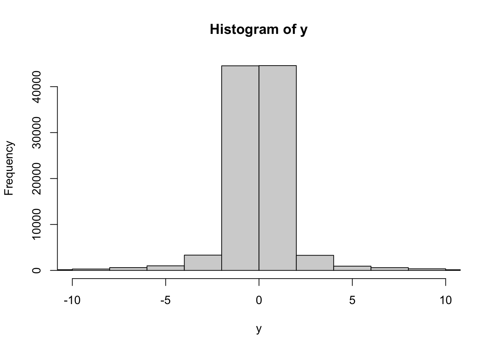

Note that this model could be appropriate for a stock that for most of the time shows little variability, but occasionally, e.g., after some earning announcement or other events, make much bigger movements.


```r
xx=seq(-9,9, length=701)
yy=dnorm(xx, 0, sqrt(3.4))
mm=0.9*dnorm(xx, 0, 1)+0.1*dnorm(xx, 0,5)
plot(xx, yy, type="l", ylim=c(0,0.4), ylab="Density",xlab="x", col="blue")
lines(xx, mm, col="red", legend=c)
title("Gaussian distribution and Normal Mixture")
box()
legend("bottomright",
       legend = c("N(0, 3.4)", "Mixture"),
       col = c("red","blue"),lwd = 1)
```


Next we use the rule of 3 sigma to find numbers of outlier and the ratio outlier between mixture distribution and $\mathcal{N}(0,3.4)$.


```r
sdev=sqrt(3.4)
gauss=2*pnorm(-3*sdev, 0, sdev)
mixt=2*0.9*pnorm(-3*sdev,0,1)+2*0.1*pnorm(-3*sdev, 0,5)

mixt/gauss
#> [1] 9.948061
```

Result show that mixture distribution produces 10 times more extrem events.

# In-class exercise 

## Dailly log-return

Suppose that the daily log-return on a stock are independent and normally distributed with mean $0.001$ and standard deviation $0.015$. Suppose you buy $1000\$$ worth of this stock.

a. What is the prbability that after one trading day your investment is worth less than $990\$$?

>Let $\mathcal{P}_1$ be the probability that after one trading day the investment is worth and $X$ be standard normal random variable.

>The daily log-return on a stock are independent and normally distributed with mean $0.001$ and standard deviation $0.015$: $r_t=\log \left( \frac{P_t}{P_{t-1}} \right) \sim \mathcal{N}(0.001,0.015)$.

>$$\begin{align*}
\mathcal{P}_1&=\mathcal{P}(1000P_t \leq 990 P_{t-1}) \\
&=\mathcal{P} \left(r_t \leq \log \left( \frac{990}{1000} \right) \right) \\
&=\mathcal{P} \left(\frac{r_t-0.001}{0.015}  \leq \frac{\log\left(  \frac{990}{1000} \right)-0.001}{0.015} \right) \\
&=\mathcal{P} \left(X  \leq -0.7366 \right) \\
&=0.23066
\end{align*}$$

>Answer: The probability that after one trading day the investment is worth less than 990\$ is $23.066\%$.

b. What is the probability that after five trading days your investment is worth less than $990\$$?

>Let $\mathcal{P}_5$ be the probability that after five trading day the investment is worth.

>The five day log-return on a stock are independent and normally distributed with mean $0.001 \times 5$ and standard deviation $0.015 \times \sqrt{5}$: $r_t=\log \left( \frac{P_t}{P_{t-1}} \right) \sim \mathcal{N}(0.001 \times 5,0.015 \times \sqrt{5})$.

>$$\begin{align*}
\mathcal{P}_5&=\mathcal{P}(1000P_t \leq 990 P_{t-5}) \\
&=\mathcal{P} \left(r_t \leq \log \left( \frac{990}{1000} \right) \right) \\
&=\mathcal{P} \left(\frac{r_t-0.001 \times 5}{0.015 \times \sqrt{5}}  \leq \frac{\log\left(  \frac{990}{1000} \right)-0.001 \times 5}{0.015 \times \sqrt{5}} \right) \\
&=\mathcal{P} \left(X  \leq -0.4487 \right) \\
&=0.32682
\end{align*}$$

>Answer: The probability that after five trading day the investment is worth less than $990\$$ is $32.68\%$.

## Skewness & Kurtosis

Calculate skewness and kurtosis of the following density function

>$$f(x) =\begin{cases}
      \frac{3}{8}x^2 & \text{for } 0<x<2\\
      0 & \text{otherwise}
    \end{cases}$$
    
>$$\begin{align*} 
\mu_1&=\mathbb{E}[X] \\
&=\int_{0}^{2}x \times \frac{3}{8}x^2\,dx \\
&=\frac{3}{2} \\
\\
\mu_2&=\mathbb{E}[X^2] \\ 
&=\int_{0}^{2}x^2 \times \frac{3}{8}x^2\,dx \\
&=\frac{12}{5} 
\end{align*}$$

>$$\begin{align*}
Sk&=\frac{\mathbb{E}[(X-\mu_1)^3]}{\sigma^3} \\
&=\frac{\int_{0}^{2}(x-\mu_1)^3 \times \frac{3}{8}x^2\,dx}{(\mu_2-\mu_1^2)^{3/2}} \\
&=\frac{\int_{0}^{2}(x-\frac{3}{2})^3 \times \frac{3}{8}x^2\,dx}{\left[ \frac{12}{5}-\left( \frac{3}{2} \right)^2 \right]^{3/2}} \\
&=-0.86 \\
\\
Kur&=\frac{\mathbb{E}[(X-\mu_1)^4]}{\sigma^4} \\
&=\frac{\int_{0}^{2}(x-\mu_1)^4 \times \frac{3}{8}x^2\,dx}{(\mu_2-\mu_1^2)^{4/2}} \\
&=\frac{\int_{0}^{2}(x-\frac{3}{2})^4 \times \frac{3}{8}x^2\,dx}{\left[ \frac{12}{5}-\left( \frac{3}{2} \right)^2 \right]^{4/2}} \\
&=3.10
\end{align*}$$

>Answer: skewness is $-0.86$ and kurtosis is $3.10$.

### Python {.unnumbered}

1. Calculate skewness and kurtosis of the log return of the exchange rate of EURO to USD.


```python
import numpy as np
import pandas as pd
# Import and calculate log return    
eurusd_url='https://docs.google.com/spreadsheets/d/e/2PACX-1vT4WqdVoUIiaMcd4jQj5by3Oauc6G4EFq9VDDrpzG2oBn6TFzyNE1yPV2fKRal5F7DmRzCtVa4nSQIw/pub?gid=0&single=true&output=csv'
eurusd=pd.read_csv(eurusd_url)
eurusd.head()
#>          Date  USD per euro
#> 0  27/07/2005        1.1990
#> 1  28/07/2005        1.2100
#> 2  29/07/2005        1.2093
#> 3  01/08/2005        1.2219
#> 4  02/08/2005        1.2217
eurusd_logret = np.log(eurusd['USD per euro']) - np.log(eurusd['USD per euro'].shift(1))
eurusd_logret[:6]
#> 0         NaN
#> 1    0.009132
#> 2   -0.000579
#> 3    0.010365
#> 4   -0.000164
#> 5    0.007421
#> Name: USD per euro, dtype: float64
```


```python
import matplotlib.pyplot as plt
# Exploratory
eurusd_logret.plot()
plt.xlabel("Date")
plt.ylabel("Log-Return'")
plt.title("Log-Return of Exchange Rate over time'")
plt.show()
```


```python
import matplotlib.pyplot as plt
fig = plt.figure()
ax1 = fig.add_axes([0.1,0.1,0.8,0.8])
eurusd_logret.plot.hist(bins = 60)
ax1.set_xlabel("Log Return")
ax1.set_ylabel("Percent")
ax1.set_title("Histogram of Log return")
plt.show()
```


```python
import pandas as pd
eurusd_logret.skew()
#> -0.07336059594162114
eurusd_logret.kurtosis()
#> 4.66844649461392
```

2. Calculate skewness and kurtosis of the log return of the exchange rate of S&P500.


```python
import numpy as np
import pandas as pd
sp500_url='https://docs.google.com/spreadsheets/d/e/2PACX-1vT4WqdVoUIiaMcd4jQj5by3Oauc6G4EFq9VDDrpzG2oBn6TFzyNE1yPV2fKRal5F7DmRzCtVa4nSQIw/pub?gid=279168786&single=true&output=csv'
sp500=pd.read_csv(sp500_url)
sp500.head()
#>          Date    Open    High     Low   Close    Volume  Adj Close
#> 0  01/03/1985  165.37  166.11  164.38  164.57  88880000     164.57
#> 1  01/04/1985  164.55  164.55  163.36  163.68  77480000     163.68
#> 2  01/07/1985  163.68  164.71  163.68  164.24  86190000     164.24
#> 3  01/08/1985  164.24  164.59  163.91  163.99  92110000     163.99
#> 4  01/09/1985  163.99  165.57  163.99  165.18  99230000     165.18
sp500_logret = np.log(sp500['Close']) - np.log(sp500['Close'].shift(1))
sp500_logret[:6]
#> 0         NaN
#> 1   -0.005423
#> 2    0.003415
#> 3   -0.001523
#> 4    0.007230
#> 5    0.018772
#> Name: Close, dtype: float64
```


```python
import matplotlib.pyplot as plt
sp500_logret.plot()
plt.xlabel("Date")
plt.ylabel("Log-Return'")
plt.title("Log-Return of S&P500 over time'")
plt.show()
```


```python
import matplotlib.pyplot as plt
fig = plt.figure()
ax1 = fig.add_axes([0.1,0.1,0.8,0.8])
sp500_logret.plot.hist(bins = 60)
ax1.set_xlabel("Log Return")
ax1.set_ylabel("Percent")
ax1.set_title("Histogram of Log return")
plt.show()
```


```python
import pandas as pd
sp500_logret.skew()
#> -1.2989867430563735
sp500_logret.kurtosis()
#> 28.28091194470013
```

### R {.unnumbered}

1. Calculate skewness and kurtosis of the log return of the exchange rate of EURO to USD.


```r
library(tidyverse)
library(moments)
# Import and calculate log return
eurusd_url="https://docs.google.com/spreadsheets/d/e/2PACX-1vT4WqdVoUIiaMcd4jQj5by3Oauc6G4EFq9VDDrpzG2oBn6TFzyNE1yPV2fKRal5F7DmRzCtVa4nSQIw/pub?gid=0&single=true&output=csv"
eurusd=read.csv(eurusd_url)
head(eurusd)
#>         Date USD.per.euro
#> 1 27/07/2005       1.1990
#> 2 28/07/2005       1.2100
#> 3 29/07/2005       1.2093
#> 4 01/08/2005       1.2219
#> 5 02/08/2005       1.2217
#> 6 03/08/2005       1.2308
eurusd_logret=eurusd[,2] %>% log() %>% diff()
head(eurusd_logret)
#> [1]  0.0091324836 -0.0005786798  0.0103653445 -0.0001636929  0.0074210330
#> [6]  0.0008933285
```


```r
plot(eurusd_logret,type="l")
```

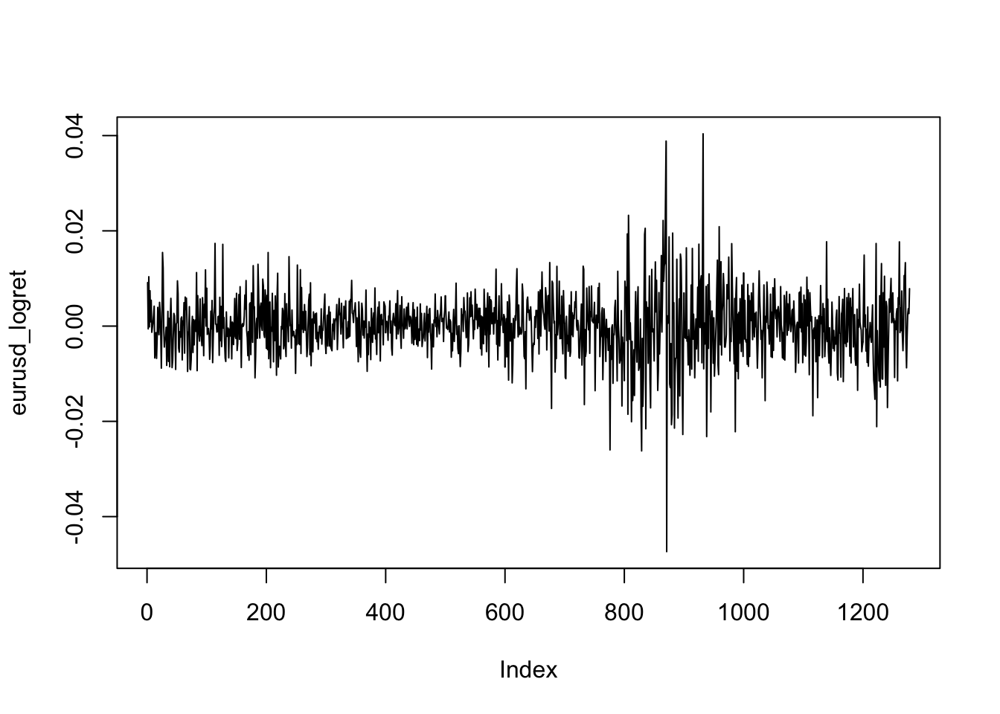


```r
hist(eurusd_logret,breaks=60)
```


```r
library(e1071)
skewness(eurusd_logret)
#> [1] -0.07318848
kurtosis(eurusd_logret)
#> [1] 4.633551
```

2. Calculate skewness and kurtosis of the log return of the exchange rate of S&P500.


```r
library(tidyverse)
library(moments)
# Import and calculate log return
sp500_url="https://docs.google.com/spreadsheets/d/e/2PACX-1vT4WqdVoUIiaMcd4jQj5by3Oauc6G4EFq9VDDrpzG2oBn6TFzyNE1yPV2fKRal5F7DmRzCtVa4nSQIw/pub?gid=279168786&single=true&output=csv"
sp500=read.csv(sp500_url)
head(sp500)
#>         Date   Open   High    Low  Close    Volume Adj.Close
#> 1 01/03/1985 165.37 166.11 164.38 164.57  88880000    164.57
#> 2 01/04/1985 164.55 164.55 163.36 163.68  77480000    163.68
#> 3 01/07/1985 163.68 164.71 163.68 164.24  86190000    164.24
#> 4 01/08/1985 164.24 164.59 163.91 163.99  92110000    163.99
#> 5 01/09/1985 163.99 165.57 163.99 165.18  99230000    165.18
#> 6  1/10/1985 165.18 168.31 164.99 168.31 124700000    168.31
sp500_logret= sp500$Adj.Close %>% log() %>% diff()
head(sp500_logret)
#> [1] -0.005422709  0.003415471 -0.001523322  0.007230338  0.018771729
#> [6] -0.002379396
```


```r
plot(sp500_logret,type="l")
```


```r
hist(sp500_logret,breaks=60)
```


```r
library(e1071)
skewness(sp500_logret)
#> [1] -1.298466
kurtosis(sp500_logret)
#> [1] 28.25285
```

## The Jarque-Bera (JB) tests

### Python {.unnumbered}

1. Check if the data of the log return of the exchange rate of Euro to USD follow the normal distribution.


```python
import scipy.stats as stats
print(stats.jarque_bera(eurusd_logret[1:]),stats.kstest(eurusd_logret[1:],'norm'))
#> Jarque_beraResult(statistic=1150.3195976112938, pvalue=0.0) KstestResult(statistic=0.48876441843556134, pvalue=5.961875332718074e-282)
```

$p-value<0.05$ so we can reject the null hypothesis $H_0: Sk=0 \text{ and } Kur=3$ meaning that the log return of exchange rate of EURUSD do not follow the normal distribution.

2. Check if the data of the log return of exchange rate of S&P500 follow the normal distribution.


```python
import scipy.stats as stats
print(stats.jarque_bera(sp500_logret[1:]),stats.kstest(sp500_logret[1:],'norm'))
#> Jarque_beraResult(statistic=250996.03457721754, pvalue=0.0) KstestResult(statistic=0.4800295652866924, pvalue=0.0)
```

$p-value<0.05$ so we can reject the null hypothesis $H_0: Sk=0 \text{ and } Kur=3$ meaning that the log return of exchange rate of S&P500 do not follow the normal distribution.

### R {.unnumbered}

1. Check if the data of the log return of the exchange rate of Euro to USD follow the normal distribution.


```r
library(moments)
jarque.test(eurusd_logret)
#> 
#> 	Jarque-Bera Normality Test
#> 
#> data:  eurusd_logret
#> JB = 1150.3, p-value < 2.2e-16
#> alternative hypothesis: greater
```

$p-value<0.05$ so we can reject the null hypothesis $H_0: Sk=0 \text{ and } Kur=3$ meaning that the log return of exchange rate of EURUSD do not follow the normal distribution.

2. Check if the data of the log return of exchange rate of S&P500 follow the normal distribution.


```r
library(moments)
jarque.test(sp500_logret)
#> 
#> 	Jarque-Bera Normality Test
#> 
#> data:  sp500_logret
#> JB = 250996, p-value < 2.2e-16
#> alternative hypothesis: greater
```

$p-value<0.05$ so we can reject the null hypothesis $H_0: Sk=0 \text{ and } Kur=3$ meaning that the log return of exchange rate of S&P500 do not follow the normal distribution.

## Q-Q plot

### Python {.unnumbered}

1. Q-Q plot of the log return of the exchange rate of Euro to USD


```python
import statsmodels.api as sm
import pylab as py
sm.qqplot(eurusd_logret, line ='q')
py.show()
```

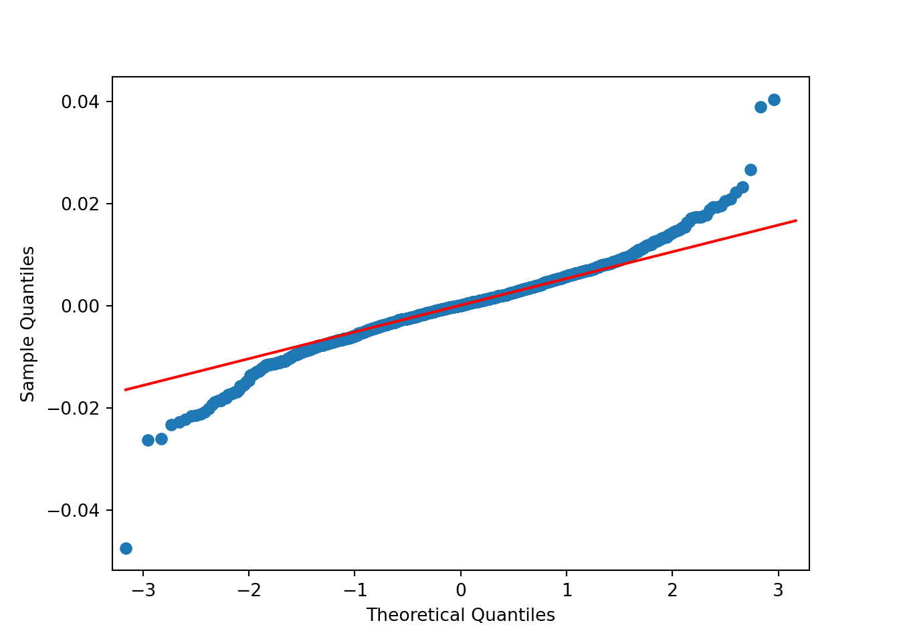

2. Q-Q plot of the log return of S&P500


```python
import statsmodels.api as sm
import pylab as py
sm.qqplot(sp500_logret, line ='q')
py.show()
```


### R {.unnumbered}

1. Q-Q plot of the log return of the exchange rate of Euro to USD


```r
qqnorm(eurusd_logret)
qqline(eurusd_logret, col = "red")
```


2. Q-Q plot of the log return of S&P500


```r
qqnorm(sp500_logret)
qqline(sp500_logret, col = "red")
```


# Homework

## Problem 1 

The prices and dividends of a stock are given as follows.


| time | $P_t$ | $D_t$ |
|------|:-----:|------:|
| 1 | 52 | 0.2 |
| 2 | 54 | 0.2 |
| 3 | 53 | 0.2 |
| 4 | 59 | 0.25 |

a. Determine $R_2$ and $R_4(3)$.

>$$\begin{align*}
R_2&=\frac{P_2-P_1+d_2}{P_1}=0.042 \\
R_3&=\frac{P_3-P_2+d_3}{P_2}=-0.015 \\
R_4&=\frac{P_4-P_3+d_4}{P_3}=0.118 \\
\end{align*}$$

>$$\begin{align*}
R_4(3)&=(1+R_4)(1+R_3)(1+R_2)-1 \\
R_4(3)&=(1+0.118)(1+-0.015)(1+0.042)-1 \\
&\approx 0.148
\end{align*}$$

>Answer: $R_2 \approx 0.042$ and $R_4(3) \approx 0.148$.

b. Determine $r_3$.

>$$\begin{align*}
r_3&=\ln(1+R_3) \\
&\approx R_3 \\
&\approx-0.015 
\end{align*}$$

>Answer: $r_3 \approx -0.015$

## Problem 2 

Assume that the log returns $r_t \sim \mathcal{N}(0.06, 0.47)$ are i.i.d. 

a. Determine the distribution of $r_t(4)$.

>$$\begin{align*}
r_t(4)&=r_t+r_{t-1}+r_{t-2}+r_{t-3} \\ 
&\sim 4 \times \mathcal{N}(0.06,0.47) \\
&\sim  \mathcal{N}(4 \times 0.06,4 \times 0.47) \\
&\sim \mathcal{N}(0.24,1.88)
\end{align*}$$

>Answer: The distribution of $r_t(4)$ is $\mathcal{N}(0.24,1.88)$.

b. Find $cov(r_2(1), r_2(2))$.

>$$\begin{align*}
cov(r_2(1),r_2(2))&=cov(r_2,r_2+r_1) \\
&=cov(r_2,r_2)+cov(r_2,r_1) \\
&=var(r_2)+cov(r_1,r_2) \\
&=0.47
\end{align*}$$

>Answer: $cov(r_2(1),r_2(2))=0.47$

c. Determine the distribution of $r_t(3)$ if $r_{t−2} = 0.6$.

>$$\begin{align*}
[r_t(3)|r_{t-2}=0.6]&=[r_t+r_{t-1}+r_{t-2}|r_{t-2}=0.6] \\
&=r_t+r_{t-1}+0.6 \\
&\sim \mathcal{N}(0.06,0.47)+\mathcal{N}(0.06,0.47)+0.6 \\
&\sim \mathcal{N}(0.72,0.94)
\end{align*}$$

>Answer: If $r_{t-2}=0.6$, the distribution of $r_t(3)$ is $\mathcal{N}(0.72,0.94)$.

## Problem 3 

Assume a stock of current price \$97 with i.i.d. log returns 

$$r_t \sim \mathcal{N}(2 \times 10^{−4}, 9 \times 10^{−4})$$ 
What is the probability that its price exceeds $\$100$ after 20 trading days?

>$$\begin{align*}
\ln \left( \frac{P_{20}}{P_0} \right) &= r_{20}(20) \\
&= \sum_{t=1}^{20}r_t \\
&\sim 20 \times \mathcal{N}(2 \times 10^{−4}, 9 \times 10^{−4}) \\
&\sim  \mathcal{N}(20 \times 2 \times 10^{−4}, 20 \times 9 \times 10^{−4}) \\
&\sim \mathcal{N}(0.004, 0.018)  \\
\\
\rightarrow \ln(P_{20})&=\ln(P_{0})+r_{20}(20) \\
&\sim \ln(97)+\mathcal{N}(0.004, 0.018) \\
&\sim \mathcal{N}(4.579, 0.018)
\end{align*}$$

>$$\begin{align*}
\mathcal{P}(P_{20}>100)&=\mathcal{P}(\ln(P_{20})>\ln(100)) \\
&=\mathcal{P} \left(\frac{\ln(P_{20})-4.579}{\sqrt{0.018}} > \frac{\ln(100)-4.579}{\sqrt{0.018}} \right) \\
&=\mathcal{P} \left(\mathcal{Z} > \frac{\ln(100)-4.579}{\sqrt{0.018}} \right) \\
&=\mathcal{P} \left(\mathcal{Z} > 0.195 \right) \\
&=\mathcal{P} \left(\mathcal{Z} < -0.195 \right) \\
&=0.423
\end{align*}$$

>Answer: The probability that its price exceeds $\$100$ after 20 trading days is 42.3\%.

## Problem 4

Assume that the log returns $r_t \sim \mathcal{N}(5 \times 10^{−4}, 0.012)$ are i.i.d. Minimize t such that 

$$\mathcal{P} \left( \frac{P_t}{P_0}  \geq 2\right) \geq 0.9$$
i.e. the probability that the price doubles after t days is at least 90%.

>$$\begin{align*}
\ln\left( \frac{P_t}{P_0} \right) &=r_t(t) \\
&=\sum_{i=1}^{t}r_i \\
&\sim t \times \mathcal{N}(5 \times 10^{−4}, 0.012) \\
&\sim  \mathcal{N}(t \times 5 \times 10^{−4},t \times 0.012)
\end{align*}$$

>$$\begin{align*}
\mathcal{P} \left( \frac{P_t}{P_0}  \geq 2\right) &= \mathcal{P} \left( \ln \left( \frac{P_t}{P_0} \right)  \geq \ln(2) \right) \\
&=\mathcal{P} \left(\frac{\ln \left( \frac{P_t}{P_0} \right)-t \times 5 \times 10^{−4}}{\sqrt{t \times 0.012}} \geq 
\frac{\ln(2)-t \times 5 \times 10^{−4}}{\sqrt{t \times 0.012}} \right) \\
&=\mathcal{P} \left(\mathcal{Z} \geq 
\frac{\ln(2)-t \times 5 \times 10^{−4}}{\sqrt{t \times 0.012}} \right) \\
&=\mathcal{P} \left(\mathcal{Z} \leq 
-\frac{\ln(2)-t \times 5 \times 10^{−4}}{\sqrt{t \times 0.012}} \right)
\end{align*}$$

>$$\begin{align*}
&\mathcal{P} \left( \frac{P_t}{P_0}  \geq 2\right) \geq 0.9 \\
&\rightarrow \mathcal{P} \left(\mathcal{Z} \leq 
-\frac{\ln(2)-t \times 5 \times 10^{−4}}{\sqrt{t \times 0.012}} \right) \geq 0.9 \\
&\rightarrow -\frac{\ln(2)-t \times 5 \times 10^{−4}}{\sqrt{t \times 0.012}}\geq\Phi^{-1}(0.9) \\
&\rightarrow -\frac{\ln(2)-t \times 5 \times 10^{−4}}{\sqrt{t \times 0.012}}\geq 1.282 \\
&\rightarrow t \geq 81638.20
\end{align*}$$

>Answer: Minimum value of t such that the probability that the price doubles after t days is 81639.

