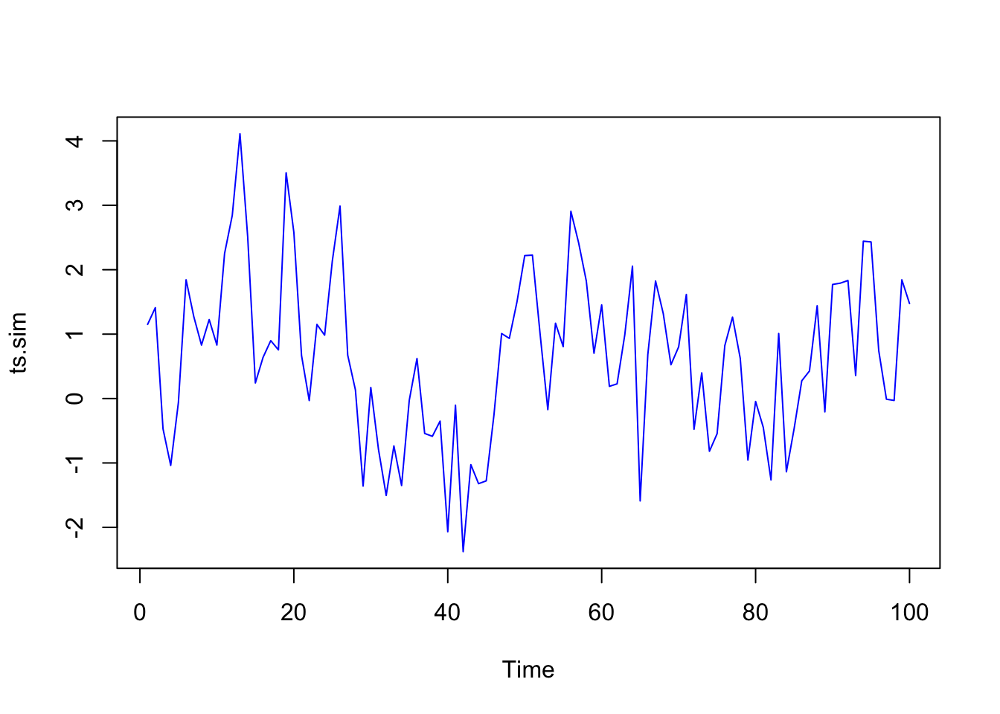
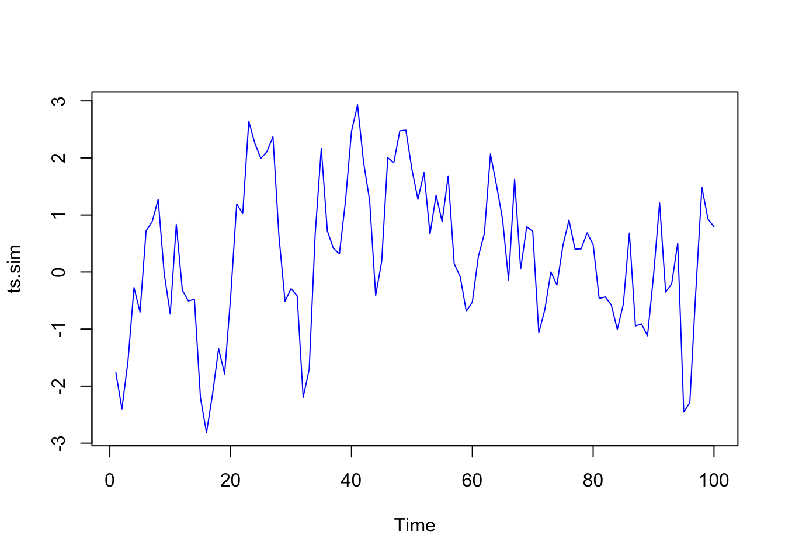

# (PART) Chapter 2 Univariate Volatility {.unnumbered}

# Stationary processes

The volatility plays a crucial role in financial risk management, it is
the main measure of risk. On the other hands, the volatility is the
key factor in, e.g., Investment decisions, Portfolio construction
(Markowitz model) and Derivative pricing (Black-Scholes model).

* In this Chapter we focus on the estimation and forecasting of
volatility for a single asset (univariate).
* The volatility plays a crucial role in financial risk management, it is
the main measure of risk. On the other hands, the volatility is the
key factor in, e.g., Investment decisions, Portfolio construction
(Markowitz model) and Derivative pricing (Black-Scholes model).
* In this Chapter we focus on the estimation and forecasting of
volatility for a single asset (univariate).

## Time series

* A time series is a sequence of observations in chronological order. For example: daily log returns on a stock or monthly values of the Consumer Price Index (CPI).
* A stochastic process is a sequence of random variables and can be viewed as the “theoretical” or “population” analog of a time series, conversely, a time series can be considered a sample from a stochastic process.
* Denote $\{X_t, t \in I\}$ the time series, where I is a time index. For example: $I = \{1, 2, 3, ...\}$ or $I = \{2000, 2001, 2002...2021\}$. Equally spaced time series are the most common in practice. This is the case of
$I = \{t_1, t_2, ..., t_n\}$, where
$(\Delta = t_{i+1} − t)_i$ with $\Delta$ is a constant.

### Remark

**Difference from traditional Statistical Inference**

* In traditional statistic inference, the data is assumed to be an i.i.d
process (random sample).
* In time series, we do not need this assumption and wish to model the dependency among observations which leads to the concept of autocorrelation.

**Some main problems in time series**

* Formulate and estimate a parametric model for $X_t$ (need to propose methods of estimation and model diagnostics).
* This point is related to the estimation of autoregressive (AR) or ARMA models.
* Estimation of Missing values (fill“gaps”).
* Prediction or Forecasting (“would like to know what a future value is”). For example our data is $x_1, x_2, ..., x_{100}$, we wish to forecast the next 10 values, $x_{101}, ..., x_{110}$. In this case, our forecasting horizon is 10.
* Plotting time series to observe fluctuations of time series, e.g., to find stationarity or non-stationarity, cycles, trends, outliers or interventions. Assisting in the formulation of a parametric model.

### Example {.unnumbered}

Consider Financial Index SP500. The data consists of excess returns $X_t = \log(S_t) −\log(S_{t−1})$. From the plot we see the following properties of $X_t$:


```r
sp500=read.csv("https://docs.google.com/spreadsheets/d/e/2PACX-1vT4WqdVoUIiaMcd4jQj5by3Oauc6G4EFq9VDDrpzG2oBn6TFzyNE1yPV2fKRal5F7DmRzCtVa4nSQIw/pub?gid=279168786&single=true&output=csv")
plot(diff(log(sp500$Close)),type="l",col="blue")
```


* The mean level of the process seems constant.
* There are sections of the data with explosive behavior (high volatility).
* The data corresponds to a non-stationary process (will define more detailed).
* The variance (or volatility) is not constant in time.
* No linear time series model will be available for this data.

## Autocovariance

### Definition

The autocovariance function a stochastic process $X$ is defined as 
$$\gamma(t,\tau)=\mathbb{E}(X_t −\mu_t)(X_{t−\tau} −\mu_{t−\tau})$$
for $\tau \in \mathbb{Z}$, where $\mu_t = E(X_t)$.

* The autocovariance function is symmetric, i.e., $\gamma(t,\tau) = \gamma(t − \tau,−\tau)$. For special case $\tau = 0$ then $\gamma(t, 0) = Var(X_t)$.
* In general $\gamma(t,\tau)$ is depend on t as well as $\tau$.

### Example {.unnumbered}

Find the autocovariance function of Brownian motion?

>$$\begin{align*}
&B_t \sim \mathcal{N}(0,t) \\
&\rightarrow E[B_t^2] =Var(B_t)=t
\end{align*}$$

>$$\begin{align*}
&B_t-B_{t-\tau} \sim \mathcal{N}(0,t-\tau) \\
&\rightarrow E[(B_t-B_{t-\tau})^2]=Var(B_t-B_{t-\tau})=t-\tau
\end{align*}$$

>$$\begin{align*}
\gamma(t,\tau)&=E[(B_t-\mu_t)(B_{t-\tau}-\mu_{t-\tau})] \\
&=E[B_tB_{t-\tau}] \\
&=-\frac{1}{2}E[(B_t-B_{t-\tau})^2-B_t^2-B_{t-\tau}^2] \\
&=-\frac{1}{2}\{E[(B_t-B_{t-\tau})^2] -E[B_t^2]-E[B_{t-\tau}^2]\} \\
&=-\frac{1}{2} [(\tau)-(t)-(t-\tau)]=t-\tau
\end{align*}$$

>Answer: The autocovariance function of Brownian motion is $t-\tau$.

##  Stationary

### Strictly Stationary

A process is said to be strictly stationary if all aspects of its behavior are unchanged by shifts in time. Mathematically, stationarity is defined as the requirement that for every $m$ and $n$ the distribution of
$(X_1, X_2, ..., X_n)$ and $(X_{1+m}, X_{2+m}, ..., X_{n+m})$ are the same.

### Weakly Stationary

A process is weakly stationary if its mean, variance, and covariance are unchanged by time shifts. More precisely, $X_1, X_2, ...,$ is a weakly stationary process if

1. $\mathbb{E}(X_t)=\mu, \forall t$
2. $Var(X_t) = \sigma_2$ (a positive finite constant) for all $t$.
3. $Cov(X_t, X_s) = \gamma(|t − s|), \forall t, s$ and some function $\gamma$.

We see that, the mean and variance do not change with time and the covariance between two observations depends only on the lag, the time distance $|t − s|$.

* The function $\gamma$ is the autocovariance function of the process and has symmetric property $\gamma(h) = \gamma(−h)$.

$$\begin{align*}
\gamma(h)=cov(X_t,X_{t+h}) \\
\rightarrow \gamma(-h)=cov(X_{t},X_{t-h})
\end{align*}$$

Let $s=t-h$ then $t=s+h$
$$\gamma(-h)=cov(X_{s+h},X_{s})=\gamma(h) $$

* The correlation between $X_t$ and $X_{t+h}$ is denoted by $\rho(h)$. Function $\rho$ is called autocorrelation function (ACF). We have $\gamma(0) = \sigma^2$ and, hence
$\gamma(h) = \sigma^2 \rho(h)$ hence $\rho(h) = \frac{\gamma(h)}{\gamma(0)}$.

The ACF is normalized on $[−1, 1]$. Since the process is required to be covariance stationary, the ACF depends only on one parameter, lag $h$.

### Example {.unnumbered}

Consider the random walk $X: X_t = c + X_{t−1} + \epsilon_t$, with c is constant and white noise $\epsilon_t$. We see that if $c \neq 0$, then $Z_t := X_t −X_{t−1} = c+ \epsilon_t$ have a non-zero mean. We call it a random walk with drift. Note that since $\epsilon_t$ is independent then we call $X_t$ a random walk with independent increments. For more convenience, assume that $c$ and $X_0$ are set to zero. We have 

$$\begin{align*}
&X_t =\epsilon_t + \epsilon_{t−1} +...+\epsilon_1 \\
\\
&\mu_t =E(X_t)=0 \\
\\
&Var(X_t) = t\sigma
\end{align*}$$

$Var(X_t)$ is not stationary but rather increases linearly with time and makes the random walk “wander”, i.e., $X_t$ takes increasingly longer excursions away from its conditional mean of $0$, and therefore is not mean-reverting.

If $s<t$ then

$$ \rho(t,s)=\sqrt{1-\frac{s}{t}} $$

which against $\rho$ depending on $t$ as well as on $s$, thus the random walk is not covariance stationary. The following figure shows the relationship among different processes: Stationary processes are the largest set, followed by white noise, martingale difference (MD), and i.i.d. processes.

<center>

</center>

## Estimating Parameters

Let $X_1, X_2, ..., X_n$ be observations from weakly stationary process. To estimate the autocovariance function, we use the sample autocovariance function defined by

$$ \hat{\gamma}(h)=\frac{1}{n} \sum_{t=1}^{n-h}(X_{t+h}-\bar X)(X-t-\bar X) $$

To estimate function $\rho$, we use the sample autocorrelation function
(sample ACF) defined as

$$\hat \rho(h) =\frac{\hat \gamma(h)}{\hat \gamma(h)}$$

* To visualize the dependencies of $x_t$ for different lags h, we use the Correlogram.
* A correlogram is a plot of $h$ (x-axis) versus its corresponding value of $\hat \rho(h)$ (y-axis).
* The correlogram may exhibit patterns and different degrees of dependency in a time series.
* A “band” of size $\frac{2}{\sqrt{n}}$ is added to the correlogram because asymptotically $\hat \rho(h) \sim \mathcal{N} \left(0, \frac{1}{n} \right)$ if the data is close to a white noise process.
* This band is used to detect significant autocorrelations, i.e. autocorelations that are different from zero.


```r
library(tidyquant)
msft <- tq_get('MSFT',from=as.Date("2010-01-01"),
               to=as.Date("2014-01-01"),
               get = "stock.prices")

msft_logret=msft$adjusted %>% 
  log() %>% 
  diff()

acf(msft_logret,lag.max=10)
```


## The ADF Test

ADF Test is also called Unit Root Test. The test uses the following null and alternative hypotheses:

* $H_0$ : The time series contains a unit root. This means that the time series is non-stationary, i.e., it has some time-dependent structure and does not have constant variance over time.
* $H_1$ : The time series is stationary.


```r
library(tseries)
adf.test(msft_logret)
#> Warning in
#> adf.test(msft_logret): p-value
#> smaller than printed p-value
#> 
#> 	Augmented Dickey-Fuller
#> 	Test
#> 
#> data:  msft_logret
#> Dickey-Fuller = -9.7881,
#> Lag order = 10, p-value =
#> 0.01
#> alternative hypothesis: stationary
```

## KPSS test

The ideas of KPSS test comes from the regression model with time
  trend

$X_t =c+ \mu_t+k \sum_{i=1}^{t} \xi_i +\eta_t$

with stationary $\eta_t$ and i.i.d $\xi$ with mean $0$ and variance $1$. Note that the third term is a random walk. So we set the null hypothesis: the data is stationary and.

$$ H_0 : k = 0 \\
H_1 : k \neq 0 $$

Test results for Microsoft data


```r
library(tseries)
kpss.test(msft_logret)
#> 
#> 	KPSS Test for Level
#> 	Stationarity
#> 
#> data:  msft_logret
#> KPSS Level = 0.20346,
#> Truncation lag parameter =
#> 7, p-value = 0.1
```

##  Ljung–Box Test

Sample ACF with test bounds.

* These bounds are used to test the null hypothesis that an autocorrelation coefficient is $0$. 
* The null hypothesis is rejected if the sample autocorrelation is outside the bounds.
* The usual level of the test is $0.05$.

### Example {.unnumbered}

(The First-order Autoregression Model (AR(1))) The time series $X = (X_t)$ is called AR(1) if the value of X at time t is a linear function of the value of $X$ at time $t − 1$ as follows

$$X_t=\delta+\phi_1 X_{t-1}+w_t=\delta+\sum_{h=0}^\infty \phi_1^h w_{t-h} $$

1. The errors $w_t \sim \mathcal{N}(0,\sigma_w^2)$ are i.i.d.
2. $w_t$ is independent of $X_t$.
3. $\phi_1<1$. This condition guarantees that $X_t$ is weakly stationary.

$$\begin{align*} 
&\mu=\mathbb{E}(X_t)=\frac{\delta}{1-\phi_1} \\
\\
&Var(X_t)=\frac{\sigma_w^2}{1-\phi_1^2} \\
\\
&Cov(X_t,X_{t+h})=\gamma(h)=\phi_1^h \times \frac{\sigma_w^2}{1-\phi_1^2} \\
\\
&\rho(h)=\phi_1^h
\end{align*}$$

Note that the magnitude of its ACF decays geometrically to zero, either slowly as when $\phi_1 = 0.95$, moderately slowly as when $\phi_1 = 0.75$, or rapidly as when $\phi_1 = 0.25$. We now simulate AR(1) and plot the ACF with $\phi_1 =0.64$ and $\sigma_w^2 =1$.


```r
library(stats)
ts.sim <- arima.sim(list(order = c(1,0,0), ar = 0.64), n = 100,sd=1)
plot(ts.sim,col="blue")
```



```r
acf(ts.sim)
```


The null hypothesis of the Ljung–Box test is
$$H_0 :\rho(1)=\rho(2)=...\rho(m)=0$$
for some m. If the Ljung–Box test rejects, then we conclude that one or more of $\rho(1), \rho(2), ..., \rho(m)$ is nonzero. The Ljung–Box test is sometimes called simply the Box test.
$$Q(m)=n(n+2) \sum_{i=j}^m \frac{\hat p^2 (j)}{n-j} \sim \chi^2(m)$$

### Example {.unnumbered}

Consider AR(1) with $\phi_1 = 0.64$ and $\sigma_w^2 = 1$, we have the results of Box test in R


```r
library(stats)
ts.sim <- arima.sim(list(order = c(1,0,0), ar = 0.64), n = 100,sd=1)
plot(ts.sim,col="blue")
```



```r
Box.test(ts.sim, lag = 10, type = "Ljung-Box")
#> 
#> 	Box-Ljung test
#> 
#> data:  ts.sim
#> X-squared = 101.62, df =
#> 10, p-value < 2.2e-16
```

If $|\phi_1| \geq 1$ then AR(1) process is nonstationary, and the mean, variance, covariances and and correlations are not constant.

##  PACF

A partial correlation is a conditional correlation. It is the correlation between two variables under the assumption that we know and take into account the values of some other set of variables.

### Example {.unnumbered}

Consider regression model in which $y$ is the response variable, $x_1, x_2, x_3$ are predictor variables. The partial correlation between y and $x_3$ is the correlation between the variables determined taking into account how both $y$ and $x_3$ are related to $x_1$ and $x_2$.

In regression, this partial correlation could be found by correlating the residuals from two different regressions:

1. Regression in which we predict $y$ from $x_1$ and $x_2$. 
2. Regression in which we predict $x_3$ from $x_1$ and $x_2$.

We correlate the “parts” of $y$ and $x_3$ that are not predicted by $x_1$ and $x_2$. We can define the partial correlation just described as
$$\frac{Cov(y, x_3 | x_1, x_2)}{\sqrt{Var(y | x_1, x_2)Var(x_3 | x_1, x_2)}}$$

For a time series, the partial autocorrelation between $x_t$ and $x_{t−h}$ is defined as the conditional correlation between $x_t$ and $x_{t−h}$ conditional on $x_{t−h+1}, ..., x_{t−1}$, the set of observations that come between the time points $t$ and $t − h$.

$$\frac{Cov(y, x_3 | x_1, x_2)}{\sqrt{Var(y | x_1, x_2)Var(x_3 | x_1, x_2)}}$$

### Example {.unnumbered}

The 3rd order (lag) partial autocorrelation is:

$$\frac{Cov(x_t, x_{t-3} | x_{t-1}, x_{t-2})}{\sqrt{Var(x_t | x_t, x_{t-3})Var(x_{t-3} | x_t, x_{t-3})}}$$

# EWMA

Denote $y_t$ the return of stock at time $t$. Then

* Volatility a weighted sum of past returns, with weights $\omega_i$, is
defined by
$$ \hat \sigma_t^2=\omega_1y_{t-1}^2+\omega_2y_{t-2}^2+...+\omega_Ly_{t-L}^2 $$
where L is the length of the estimation window, i.e., the number of observations used in the calculation. This is called MA model.
* An extension of MA model is Exponentially weighted moving average. Let the weights be exponentially declining, and denote them by $\lambda^i$
$$ \hat \sigma_t^2=\lambda y_{t-1}^2+\lambda^2 y_{t-2}^2+...+\lambda^L y_{t-L}^2 $$
where $0 < \lambda < 1$. If $L$ is large enough, the term αn are negligible for all $n > L$. So we set $L = \infty$.
* Note that the sum of weights is
$$\frac{\lambda}{1-\lambda}=\sum_{i=1}^\infty \lambda^i$$
So the exponentially weighted moving average is defined by
$$ \hat \sigma_t^2=\frac{1-\lambda}{\lambda} \sum_{i=1}^{\infty}\lambda^i y_{t-i}^2 $$
and, hence, we get the EWMA equation (why???)
$$ \hat \sigma_t^2=\lambda \hat \sigma_{t-1}^2+(1-\lambda)y_{t-1}^2 $$
* Note that JP Morgan set for daily data with $\lambda = 0.94$.

## Example {.unnumbered}

Suppose that $\lambda = 0.9$, the volatility estimated for a market variable for
day $n − 1$ is $1\%$ per day, and during day $n − 1$ the market variable
increased by $2\%$. This means that $\sigma_{n-1}^2=0.01^2=0.0001$ and $y_{n-1}^2=0.02^2=0.0004$. From equation (1) we get
$$\sigma_n^2=0.9 \times 0.0001 + 0.1 \times 0.0004=0.00013 $$
The estimate of the volatility for day $n$ is $\sigma_n = \sqrt{0.00013} = 1.4\%$ per
   day. Note that the expected value of $y_{n-1}^2$ is $\sigma_{n-1}^2= 0.0001$. Hence, realized value of $y_{n−1}^2 = 0.0002$ is greater that expected value, and as a
result our volatility estimate increase. If the realized value of $y_{n−1}^2$ has been less than its expected valued, our estimate of the volatility would have decreased.

# ARCH and GARCH

## ARCH

* The ARCH model was proposed by Robert Engle in 1982 called autoregressive conditionally heteroscadastic.
* Most volatility models derive from this.
* Returns are assumed to have conditional distribution (here
assumed to be normal)
$$y_t \sim \mathcal{N} (0,\sigma_t^2)$$
or we can write
$$y_t=\sigma_t \epsilon_t $$
where $\epsilon_t \sim \mathcal{N}(0, 1)$ is called residual.

ARCH(L1) is defined by
$$Var(y_t | y_{t−1}, y_{t−2}, ..., y_{t−L_1} ) = \sigma_t^2 = \omega + \sum_{i=1}^{L_1} \alpha_i y_{t−i}^2$$
where $L_1$ is called the lag of the model. It is seen that in the ARCH model, the volatility is weighted average of past returns.  

The most common form is ARCH (1)
$$Var(y_t | y_{t−1}) = \sigma_t^2 = \omega + \alpha y_{t−1}^2$$
where $\omega$ and $\alpha$ are parameters that can be estimated by maximum likelihood.

If we assume that the series has $mean = 0$ (this can always be done by centering), then the ARCH model could be written as
$$\begin{align*}
&y_t = \sigma_t \epsilon_t \\
&\sigma_t=\sqrt{\omega+\alpha y_{t-1}^2} \\
&\epsilon_t \sim \mathcal{N}(0,1),i.i.d
\end{align*}$$

We require that $\omega,\alpha>0$ so that $\omega+\alpha y_{t-1}^2>0, \forall t$. We also require that $\alpha < 1$ in order to the process to be stationary with a finite variance. Now we have
$$y_t^2 =\epsilon_t^2(\omega+\alpha y_{t−1}^2)$$
which is similar to an AR(1) for variable $y_t^2$ and with multiplicative noise with a mean of $1$ rather than additive noise with a mean of $0$.

## GARCH

* It turns out that ARCH model is not a very good model and almost nobody uses it. Because, it needs to use information from many days before t to calculate volatility on day t. That is, it needs a lot of lags.
* The $GARCH(L_1, L_2)$ model is defines as
$$ \sigma_t^2=\omega+\sum_{i=1}^{L_1} \alpha_i y_{t-i}^2 + \sum_{i=1}^{L_2} \beta_i \sigma_{t-i}^2 $$ 
and, hence, $GARCH(1,1)$
$$ \sigma_t^2=\omega+\alpha y_{t-1}^2+\beta \sigma_{t-1}^2 $$
* $GARCH(1,1)$ is the most common specification.

### Unconditional volatility

* The unconditional volatility (so-called the long-run variance rate) is the unconditional expectation of volatility on given time
$$\sigma^2=\mathbb{E}(\sigma_t^2) $$
so we have
$$ \sigma^2=\mathbb{E}(\omega+\alpha y_{t-1}^2+\beta \sigma_{t-1}^2)=\omega +\alpha \sigma^2+\beta \sigma^2 $$
Hence,
$$ \sigma^2=\frac{\omega}{1-\alpha-\beta} $$
* So to ensure positive volatility forecasts we need the condition $\omega, \alpha, \beta \geq 0$
Because if any parameter is negative $\sigma_{t+1}$ may be negative.
* For stationary we need condition $\alpha+\beta<1$
Setting $\gamma := 1 − \alpha − \beta$ and $V := \sigma^2$ (called long-run variance rate). We have
$$ \sigma_t^2=\gamma V+\alpha y_{t-1}^2+\beta \sigma_{t-1}^2 $$

### Meaning of Parameters

* The parameter $\alpha$ is news, it shows that how the volatility reacts to new information.
* The parameter $\beta$ is memory, it shows that how much volatility remembers from the past.
* The sum $\alpha + \beta$ determines how quickly the predictability (memory) of the process dies out:
<ul>
<li> if $\alpha + \beta \approx 0$ predictability will die out very quickly.</li> 
<li> if $\alpha + \beta \approx 1$ predictability will die out very slowly.</li>
</ul>

#### Example {.unnumbered}

Suppose that a $GARCH(1,1)$ model is estimated from daily data is 
$$\sigma_n =0.000002+0.13y_{n-1}^2 +0.86 \sigma_{n-1}^2$$
This corresponds to $\omega = 0.000002, \alpha = 0.13, \beta = 0.86$. We have
$$\sigma^2 = \frac{\omega}{1-\alpha-\beta}= 0.0002$$
or $\sigma=\sqrt{0.0002}=0.014=1.4\%$ per day.  

Suppose that the estimate of the volatility on day $n − 1$ is $1.6\%$ per day
so that $\sigma^2 = 0.0162 = 0.000256$, and on that day $n − 1$ the market
variable decreased by $1\%$ so that $y_{n−1}^2 = 0.01^2 = 0.0001$. Then
$$\sigma_n^2 = 0.000002 + 0.13 × 0.0001 + 0.86 × 0.000256 = 0.00023516$$
the new estimate of the volatility is: $\sqrt{0.00023516} = 0.0153$ or $1.53\%$ per day.

# Maximum likelihood

Maximum likelihood is the most important and widespread method of estimation. What is maximum likelihood?

Ask the question which parameters most likely generated the data we have. Suppose we have a sample of $\{−0.2, 3, 4, −1, 0.5\}$. In the following three possibilities, which is most likely for parameters?


| case | $μ$ | $σ$ |
|------|:-----:|---------:|
| 1 | 1 | 5 |
| 2 | -2 | 2 |
| 3 | 1 | 2 |

Let $Y = (y_1,y_2,...,y_n)$ be a vector of data and let $\theta = (\theta_1,\theta_2,...,\theta_p)$ be a vector of parameters. Let $f(Y | \theta)$ be the density of Y which depends on the parameters. The function
$$L(\theta) := f(Y | \theta)$$
is viewed as the function of $\theta$ with $Y$ fixed at the observed data is called
the likelihood function.

* The maximum likelihood estimator (MLE) is the value of $\theta$ that maximizes the likelihood function. We denote the MLE by $\hat \theta_{ML}$.
* It is mathematically easier to maximize $\log L(\theta)$, which is called the log-likelihood. If the data are independent, then the likelihood is the product of the marginal densities.

## Application to ARCH(1)

Consider ARCH(1) model:

$$  εt ∼N(0,1) $$
For $t = 2$ we have the density??

$$ f(y_2|y_1)=\frac{1}{\sqrt{2\pi(\omega+\alpha y_1^2)}} e^{-\frac{1}{2} \frac{y_2^2}{2\omega+\alpha y_1^2}} $$
Hence, the joint density
$$ \prod_{t=2}^T f(y_t|y_{t-1})=\prod_{t=2}^T \frac{1}{\sqrt{2\pi(\omega+\alpha y_{t-1}^2)}} e^{-\frac{1}{2} \frac{y_t^2}{2\omega+\alpha y_{t-1}^2}} $$
and, the log likelihood
$$ \log(L(\omega, \alpha)) =-\frac{T-1}{2} \log(2\pi)-\frac{1}{2} \sum_{t=2}^T \left( \log(\omega+\alpha y_{t-1}^2) + \frac{y_t^2}{\omega+\alpha y_{t-1}^2} \right) $$

##  Application to GARCH(1,1)

$$ \sigma_t^2=\omega+\alpha y_{t-1}^2 +\beta \sigma_{t-1}^2$$
Hence, the joint density
$$ f(y_2|y_1)=\frac{1}{\sqrt{2\pi(\omega+\alpha y_1^2+\beta \hat \sigma_1^2)}} e^{-\frac{1}{2} \frac{y_2^2}{\omega +\alpha y_1^2+\beta \hat \sigma_1^2}} $$
and, the log likelihood
$$ \log(L(\omega, \alpha)) =-\frac{T-1}{2} \log(2\pi)-\frac{1}{2} \sum_{t=2}^T \left( \log(\omega+\alpha y_{t-1}^2+\beta \hat \sigma_{t-1}^2) + \frac{y_t^2}{\omega+\alpha y_{t-1}^2+\beta \hat \sigma_{t-1}^2} \right) $$

### The importance of σ1

* $\sigma_1$ can make a large difference.
* Especially when the sample size is small. 
* Typically set $\sigma_1 = \hat \sigma$.

### Volatility targeting {.unnumbered}

* Since we have the long-run variance rate 
$$\sigma^2= \frac{\omega}{1-\alpha-\beta}$$.
* We can set
$$ \omega=\hat \sigma^2(1-\alpha-\beta) $$
where $\hat \sigma^2$ is is the sample variance.
* Hence we save one parameter in the estimation.

# Future volatility

The variance rate estimated at the end of day $n − 1$ for $n$ day when apply $GARCH(1,1)$ model is

$$ \sigma_n^2=\omega+\alpha y_{n-1}^2+\beta \sigma_{n-1}^2=\sigma^2(1-\alpha-\beta)+\alpha y_{n-1}^2+\beta \sigma_{n-1}^2 $$
or
$$ \sigma_n^2- \sigma^2=\alpha (y_{n-1}^2-\sigma^2)+\beta (\sigma_{n-1}^2-\sigma^2) $$
On day $n+t$ in the future we have
$$ \sigma_{n+t}^2 - \sigma^2=\alpha (y_{n+t-1}^2-\sigma^2)+\beta(\sigma_{n+t-1}^2-\sigma^2) $$
Hence,
$$ \mathbb{E}[\sigma_{n+t}^2 - \sigma^2]=(\alpha+\beta)\mathbb{E}[\sigma_{n+t-1}^2 - \sigma^2] $$
By induction we obtain
$$ \mathbb{E}(\sigma_{n+t}^2) = \sigma^22 + (\alpha + \beta)^t(\sigma_n^2 − \sigma^2) $$

## Example {.unnumbered}

For the S&P data consider earlier, $\alpha + \beta = 0.9935$, the log-run variance rate $\sigma^2 = 0.0002075$ (or $\sigma = 1.44\%$ per day). Suppose that our estimate of the current variance rate per day is $0.0003$ (This corresponds to a volatility of $1.732\%$ per day). In $t = 10$ days, calculate the expected variance rate??  

We have $\sigma_n^2 = 0.0003$
Hence
$\mathbb{E}(\sigma_{n+10}^2 ) = 0.0002075 + 0.993510^{10} × (0.0003 − 0.0002075) = 0.0002942$
or the expected volatility per day is $\sqrt{0.0002942} = 1.72\%$, still above the long-term volatility of $1.44\%$ per day.

##  Volatility term structures {.unnumbered}

Suppose it is day $n$. We define
$$V(t) = \mathbb{E}(\sigma_{n+1}^2 )$$
and
$$ a:= \log \left( \frac{1}{\alpha+\beta} \right) $$
From $\mathbb{E}(\sigma_{n+t}^2) = \sigma^22 + (\alpha + \beta)^t(\sigma_n^2 − \sigma^2)$ we have

$$V(t) = \sigma^2 + e^{−at}(V(0) − \sigma^2)$$
Then we have the average variance rate per day between today and time T.

$$ \frac{1}{T} \int_0^T V(t) \,dt=\frac{1}{T} \int_0^T \left( \sigma^2 + e^{−at}(V(0) − \sigma^2) \right)=\sigma^2+\frac{1-e^{-aT}}{aT} [V(0)-\sigma^2] $$

Now we define $sigma(T)$ the volatility per annum that should be used to price a T-day option under $GARCH(1,1)$ model. Then we have

$$ \sigma^2(T)=252 \left( \sigma^2+\frac{1-e^{-aT}}{aT} [V(0)-\sigma^2] \right) $$
This relationship between the volatility of options and their maturities is referred to as the volatility term structure.

### Example {.unnumbered}

For S&P data, using GARCH(1,1) model we obtain the coefficients $\omega = 0.0000013465$, $\alpha = 0.083394$ and $\beta = b = 0.910116$. So from 
$$ \sigma^2(T)=252 \left( \sigma^2+\frac{1-e^{-aT}}{aT} [V(0)-\sigma^2] \right) $$
assume that $V(0) = 0.0003$ we have
$$ \sigma^2=\frac{0.0000013465}{1 − 0.083394 − 0.910116}=0.0002073 $$
and $a = \log \left( \frac{1}{0.99351} \right) = 0.00651$. Hence,
$$ \sigma^2(T)=252 \left( 0.0002073+\frac{1-e^{-0.00651 \times T}}{0.00651 \times T}[0.0003-0.0002073] \right) $$

For the option life (days) T = 10, 30, 50, 100, 500, we obtain the option
volatility ($\%$ per annum)


| Option life (days) | 10 | 30 | 50 | 100 | 500 |
|------|:-----:|------:|------:|------:|------:|
| Option volatility | 27.36 | 27.10 | 26.87 | 26.35 | 24.32 |

# In-class exercise

## Autocovariance

1. Find the autocovariance function of Brownian motion?

>$$\begin{align*}
&B_t \sim \mathcal{N}(0,t) \\
&\rightarrow E[B_t^2] =Var(B_t)=t
\end{align*}$$

>$$\begin{align*}
&B_t-B_{t-\tau} \sim \mathcal{N}(0,t-\tau) \\
&\rightarrow E[(B_t-B_{t-\tau})^2]=Var(B_t-B_{t-\tau})=t-\tau
\end{align*}$$

>$$\begin{align*}
\gamma(t,\tau)&=E[(B_t-\mu_t)(B_{t-\tau}-\mu_{t-\tau})] \\
&=E[B_tB_{t-\tau}] \\
&=-\frac{1}{2}E[(B_t-B_{t-\tau})^2-B_t^2-B_{t-\tau}^2] \\
&=-\frac{1}{2}\{E[(B_t-B_{t-\tau})^2] -E[B_t^2]-E[B_{t-\tau}^2]\} \\
&=-\frac{1}{2} [(\tau)-(t)-(t-\tau)]=t-\tau
\end{align*}$$

>Answer: The autocovariance function of Brownian motion is $t-\tau$


2. Let $cov (X_t,X_{t+h})=\gamma(h)$

a. Prove that $\gamma(h)=\gamma(-h)$

>$$\begin{align*}
\gamma(h)=cov(X_t,X_{t+h}) \\
\rightarrow \gamma(-h)=cov(X_{t},X_{t-h})
\end{align*}$$

>Let $s=t-h$ then $t=s+h$
$$\gamma(-h)=cov(X_{s+h},X_{s})=\gamma(h) $$

b. Prove that $-1 \leq \rho(h) \le1$

>$$\begin{align*}
&\mathbb{E}[(X_{t+h} \pm X_{t})^2] \ge 0 \\ 
&\rightarrow \mathbb{E}[X_{t+h}^2] + \mathbb{E}[X_{t}^2] \pm 2 \mathbb{E}[X_{t+h}X_{t}] \ge 0 \\ 
&\rightarrow 2 \gamma(0) \pm 2\gamma(h) \ge 0 \\ 
&\rightarrow -2 \gamma(0) \leq 2\gamma(h) \leq 2 \gamma(0) \\
&\rightarrow -1 \leq \rho(h) \leq 1
\end{align*}$$

# Homework

## Problem 5 

Let $(X_n)_{n \geq 0}$ be a log-normal geometric random walk with parameters $\mu$ and $\sigma$, i.e.

$$ X_k= X_0 e^{\sum_{i=1}^k r_i}, \forall k \in \mathbb{N} $$

where $r_i \sim \mathcal{N}(\mu,\sigma^2)$ are i.i.d and $X_0 \neq 0$ is constant.

a. Determine $P(X_2 > 1.3X_0)$.

>$$\begin{align*}
r_1+r_2 &\sim \mathcal{N}(\mu,\sigma^2)+\mathcal{N}(\mu,\sigma^2) \\ 
&\sim \mathcal{N}(2\mu,2\sigma^2)
\end{align*}$$

>$$\begin{align*} 
\mathbb{P}(X_2>1.3X_0) &= \mathbb{P} \left( \frac{X_2}{X_0}>1.3 \right) \\
&= \mathbb{P} \left( e^{r_1+r_2}>1.3 \right) \\
&=\mathbb{P} \left({r_1+r_2}>\ln(1.3) \right) \\
&=\mathbb{P} \left( \mathcal{Z} > \frac{\ln(1.3)-2\mu}{\sigma \sqrt{2}} \right) \\
&=1-\Phi \left( \frac{\ln(1.3)-2\mu}{\sigma \sqrt{2}} \right)
\end{align*}$$

>Answer: $\mathbb{P}(X_2>1.3X_0)=1-\Phi \left( \frac{\ln(1.3)-2\mu}{\sigma \sqrt{2}} \right)$

b. Find the density $f_{X_1}$ of $X_1$.

>$$\begin{align*} 
F_{X_1}(x) &=\mathbb{P}(X_1 \leq x) \\
&=\mathbb(X_0e^{r_1} \leq x) \\
&=\mathbb{P}(r_1 \leq \ln(x)-\ln(X_0) \\
&=\mathbb{P} \left( \mathcal{Z} \leq \frac{\ln(x)-\ln(X_0)-\mu}{\sigma} \right) \\
&=\frac{1}{\sqrt{2\pi}} \int_{-\infty}^{\frac{\ln(x)-\ln(X_0)-\mu}{\sigma}} e^{\frac{-t^2}{2}}\,dt \\ \rightarrow f_{X_1}(x) &= \frac{1}{\sqrt{2\pi}} \times \left( \frac{\ln(x)-\ln(X_0)-\mu}{\sigma} \right)' \times e^{\frac{-\left( \frac{\ln(x)-\ln(X_0)-\mu}{\sigma} \right)^2}{2}} \\
&=\frac{e^{-\frac{(\ln(x)-\ln(X_0)-\mu)^2}{2\sigma^2}}}{\sigma x \sqrt{2\pi}}
\end{align*}$$

>Answer: $f_{X_1}(x)=\frac{e^{-\frac{(\ln(x)-\ln(X_0)-\mu)^2}{2\sigma^2}}}{\sigma x \sqrt{2\pi}}$

c. Find a formula for the $0.9$ quantile of $X_k$ for each $k \in \mathbb{N}$.

>Let $x_k$ be the 0.9 quantile of $X_k$
$$\begin{align*}
\sum_{i=1}^{k} r_i &\sim k \times \mathcal{N}(\mu,\sigma^2) \\ 
&\sim \mathcal{N}(k\mu,k\sigma^2) \\ 
\end{align*}$$

>$$\begin{align*} 
\mathbb{P}(X_k \leq x_k) &= \mathbb{P} \left( \frac{X_k}{X_0} \leq \frac{x_k}{X_0} \right) \\
&= \mathbb{P} \left( e^{\sum_{i=1}^{k} r_i} \leq \frac{x_k}{X_0} \right) \\
&=\mathbb{P} \left({\sum_{i=1}^{k} r_i} \leq \ln(x_k) -\ln(X_0) \right) \\
&=\mathbb{P} \left( \mathcal{Z} \leq \frac{\ln(x_k) -\ln(X_0)-k\mu}{\sigma \sqrt{k}} \right) \\
&=\Phi \left( \frac{\ln(x_k) -\ln(X_0)-k\mu}{\sigma \sqrt{k}} \right)
\end{align*}$$

>$$\begin{align*} 
&\mathbb{P}(X_k \leq x_k) = 0.9 \\
&\rightarrow \Phi \left( \frac{\ln(x_k) -\ln(X_0)-k\mu}{\sigma \sqrt{k}} \right) = 0.9 \\
&\rightarrow \frac{\ln(x_k) -\ln(X_0)-k\mu}{\sigma \sqrt{k}}=\Phi^{-1}(0.9) \\
&\rightarrow x_k=X_0 e^{\Phi^{-1}(0.9) \sigma \sqrt{k} +k\mu}
\end{align*}$$

>Answer: The formula for the 0.9 quantile of $X_k$ for each $k \in \mathbb{N}$ is $X_0 e^{\Phi^{-1}(0.9) \sigma \sqrt{k} +k\mu}$.

## Problem 6

Given data of McDonald’s stock returns. Using R or Python:

### Python {.unnumbered}

a. Plot histogram and display fitted normal.


```python
import pandas as pd

# Import data from my Google Spreadsheet
mcd_url = 'https://docs.google.com/spreadsheets/d/e/2PACX-1vTI1rEZM9rAQqxrz5ogOTzKJZXD99n6vmsRpZXFzILLoyBs-ViFx24WOC5jqf61uaG7M5XDv6h3kG4D/pub?gid=2115254660&single=true&output=csv'
mcd = pd.read_csv(mcd_url)
mcd.head()
#>        Date   Open   High    Low  Close    Volume  Adj Close
#> 0  1/4/2010  62.63  63.07  62.31  62.78   5839300      53.99
#> 1  1/5/2010  62.66  62.75  62.19  62.30   7099000      53.58
#> 2  1/6/2010  62.20  62.41  61.06  61.45  10551300      52.85
#> 3  1/7/2010  61.25  62.34  61.11  61.90   7517700      53.24
#> 4  1/8/2010  62.27  62.41  61.60  61.84   6107300      53.19
```


```python
import numpy as np
# Calculate Log Returns
mcd_logret = np.log(list(mcd['Adj Close'])[1:]) - np.log(list(mcd['Adj Close'])[:-1])
mcd_logret[:6] # first 10 elements
#> array([-0.00762298, -0.01371815,  0.00735228, -0.00093958,  0.00767866,
#>         0.00539586])
```


```python
from scipy.stats.distributions import norm
import matplotlib.pyplot as plt
# Histogram and fitted normal distribution
mu, var = norm.fit(mcd_logret)
x = np.linspace(min(mcd_logret), max(mcd_logret), 100)
fitted_mcd_logret = norm.pdf(x, mu, var)
plt.hist(mcd_logret, density = True)
#> (array([ 0.18620447,  0.46551117,  2.60686253,  9.4964278 , 37.24089335,
#>        46.27180998, 10.6136546 ,  2.2344536 ,  0.09310223,  0.2793067 ]), array([-0.04555068, -0.03641728, -0.02728388, -0.01815047, -0.00901707,
#>         0.00011633,  0.00924973,  0.01838313,  0.02751654,  0.03664994,
#>         0.04578334]), <BarContainer object of 10 artists>)
plt.plot(x, fitted_mcd_logret, 'r-')
plt.show()
```


b. Use QQ plot and Jaque-Bera test to test for normality and interpret the result.


```python
import statsmodels.api as sm
import pylab
sm.qqplot(mcd_logret, line = 's')
pylab.show()
```


There are presence of outliers, i.e. the log returns seems not normally distributed.


```python
from scipy.stats import jarque_bera
# Carry out a Jarque-Bera tests
jarque_bera(mcd_logret)
#> Jarque_beraResult(statistic=367.2407128291914, pvalue=0.0)
```

$p−value<0.05$ so we can reject the null hypothesis $H_0$: $Sk=0$ and $Kur=3$ meaning that the log return of the data do not follow the normal distribution.

c. Calculate skewness, kurtosis and give some comments related to risk management.


```python
from scipy.stats import skew, kurtosis
# Skewness and Kurtosis
print('Skewness:', skew(mcd_logret))
#> Skewness: -0.1604213839619458
print('Excess Kurtosis:', kurtosis(mcd_logret))
#> Excess Kurtosis: 2.7187806721684025
```

A negative skewness indicates a left-skewed distribution, i.e. investors can expect recurrent small gains and few huge losses from investing in McDonalds' stock. Hence the stock is not potential for investors since it is expected that huge losses may overwhelm the frequent (but small) gains.

A positive excess kurtosis indicates a leptokurtic distribution, i.e. it has large outliers. Hence the McDonalds' stock is not desirable for pessimistic investors since chance of experiencing big losses is high.


### R {.unnumbered}

a. Plot histogram and display fitted normal.


```r
library(tidyverse)

# Import data from my Google Spreadsheet
mcd_url="https://docs.google.com/spreadsheets/d/e/2PACX-1vTI1rEZM9rAQqxrz5ogOTzKJZXD99n6vmsRpZXFzILLoyBs-ViFx24WOC5jqf61uaG7M5XDv6h3kG4D/pub?gid=2115254660&single=true&output=csv"
mcd=read.csv(mcd_url)

# Calculate log return
mcd_logret= mcd$Adj.Close %>% 
  log() %>% 
  diff()
head(mcd_logret)
#> [1] -0.0076229801
#> [2] -0.0137181518
#> [3]  0.0073522812
#> [4] -0.0009395848
#> [5]  0.0076786593
#> [6]  0.0053958639
```


```r
# Histogram and fitted normal distribution
h=hist(mcd_logret)
xfit <- seq(min(mcd_logret), max(mcd_logret), length = 100)
yfit <- dnorm(xfit, mean = mean(mcd_logret), sd = sd(mcd_logret)) * diff(h$mids[1:2]) * length(mcd_logret)
lines(xfit, yfit, col = "red", lwd = 2)
```


b. Use QQ plot and Jaque-Bera test to test for normality and interpret the result. (c) Calculate skewness, kurtosis and give some comments related to risk management.


```r
library(moments)
# Make a Q-Q plot and add a red line
qqnorm(mcd_logret)
qqline(mcd_logret, col = "red")
```


There are presence of outliers, i.e. the log returns seems not normally distributed.


```r
# Carry out a Jarque-Bera test
jarque.test(mcd_logret)
#> 
#> 	Jarque-Bera Normality
#> 	Test
#> 
#> data:  mcd_logret
#> JB = 367.24, p-value <
#> 2.2e-16
#> alternative hypothesis: greater
```

$p−value<0.05$ so we can reject the null hypothesis $H_0$: $Sk=0$ and $Kur=3$ meaning that the log return of the data do not follow the normal distribution.

c. Calculate skewness, kurtosis and give some comments related to risk management.


```r
library(moments)
skewness(mcd_logret)
#> [1] -0.1604214
kurtosis(mcd_logret)-3
#> [1] 2.718781
```

A negative skewness indicates a left-skewed distribution, i.e. investors can expect recurrent small gains and few huge losses from investing in McDonalds' stock. Hence the stock is not potential for investors since it is expected that huge losses may overwhelm the frequent (but small) gains.

A positive excess kurtosis indicates a leptokurtic distribution, i.e. it has large outliers. Hence the McDonalds' stock is not desirable for pessimistic investors since chance of experiencing big losses is high.

## Problem 7

Assume a random variable X has the distribution
$$P(X =−4)= \frac{1}{3}, P(X =1)= \frac{1}{2}, P(X =5)= \frac{1}{6}$$

Check that $X$ has skewness $0$, but is not distributed symmetrically.

>$$\begin{align*}
E[X^3] &=\mathbb{P}(X=-4) \times (-4)^3+\mathbb{P}(X=1) \times (1)^3+\mathbb{P}(X=5) \times (5)^3 \\
&=\frac{1}{3} \times (-64) + \frac{1}{2} \times (1)+\frac{1}{6} \times (125) \\
&=0 
\end{align*}$$

>Since $\mu = E[X] = 0$ and $\sigma^2 = Var(X) = 10$, the skewness of $X$ is given by
$$ \tilde \mu_3=\frac{\mathbb{E}(X^3)-3\mu\sigma^2-\mu^3}{\sigma^3}=\frac{0-0-0}{\sqrt{1000}}=0 $$

>Suppose X has a symmetric distribution, there exists $x_0 \in \mathbb{R}$ such that
$$ \mathbb{P}(X=x_0-\delta)=\mathbb{P}(X=x_0+\delta), \forall \delta >0 $$

>Letting $\delta=x_0-1$ implies
$$\mathbb{P}(X=1)=\mathbb{P}(X=2x_0-1)=\frac{1}{2}, \forall \delta >0$$

>thus $2x_0-1=1$, i.e. $x_0=1$. Letting $\delta=4$ gives
$$ 0=\mathbb{P}(X=-3)=\mathbb{P}(X=5)=\frac{1}{6} (!) $$

## Problem 8

a. Show that if X, Y are random variables and cov(X, Y ) = 0, then X, Y may not be independent.

>Let $X$ be the normal distribution and $Y$ be $X^2$ then
$$ Cov(X,Y)=\mathbb{E}(XY)-E(X)E(Y)=0 $$

>However,
$$ 0.25=\mathbb{E}(Y|X=0.5) \neq E(Y)=Var(X)=1 $$

>Hence, X and Y are not inidependent.

b. Prove that correlation is invariant under linear transformations.

>Let a, b, c, d be constants with ac > 0, then for any random variables X, Y, we have
$$\begin{align*}
Corr(aX+b,cY+d)&=\frac{Cov(aX+b,cY++d)}{\sqrt{Var(aX+b)Var(cY+d)}} \\
&=\frac{ac \times Cov(X,Y)}{\sqrt{a^2c^2Var(X)Var(Y)}} \\
&=\frac{Cov(X,Y)}{\sqrt{Var(X)Var(Y)}} \\
&=Corr(X,Y) 
\end{align*}$$
